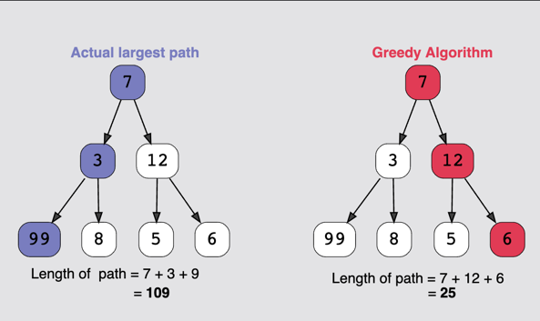

# Brute Force Method

Let’s start off our discussion on algorithms with the most straightforward and exhaustive option—the **Brute Force** approach to solving a problem. This method requires us to go through all the possibilities to find a solution to the problem we want to solve. For instance, if we have a list of integers and we want to find the minimum, maximum, or a certain element in that list, the Brute Force approach requires us to go through all the elements to find that specific element.

## Example: Linear Search

**Linear/Sequential Search** is a method for finding a target value within a given list. It sequentially checks each element of the list for the target value until a match is found or all the elements have been searched. Linear Search runs in linear time (at its worst) and makes `n` comparisons (at most), where `n` is the length of the list.

Let’s assume that we are given the following list of unsorted integers:

```
[5, 8, 1, 3, 9, 2, 7]
```


If we want to find the index of a specific element, such as `9`, the brute force approach would involve checking each element one by one until we find the target.

### Modifying the Problem

If we modify the task slightly and ask to find the index of the maximum or minimum value in the list, the Brute Force approach would involve traversing the entire list to compare each element and determine the maximum or minimum value.

### Time Complexity:
- **O(n)**: We would have to do `n` comparisons in the worst case if the element we want to find is present on the last index of the array.

## Advantages of Brute Force

- **Simplicity**: The Brute Force method is easy to understand and implement.
- **Guaranteed Solution**: If a solution exists, the brute force method is guaranteed to find it, as it checks every possible option.

## Disadvantages of Brute Force

- **Inefficiency**: Brute Force methods are typically the least efficient. It might be the first solution that comes to mind, but it is often suboptimal in terms of time complexity.
- **No Performance Improvements**: There are no shortcuts to improve performance in the brute force method; it checks all possibilities exhaustively.


# Greedy Algorithm

A **Greedy algorithm** is an algorithmic paradigm that builds up a solution, piece by piece. This means it chooses the next piece that offers the most obvious and immediate benefit. A Greedy algorithm, as the name implies, always makes the choice that seems to be the best at the time. It makes a **locally-optimal** choice in the hope that it will lead to a **globally-optimal solution**.

**Note**: If you have a problem where the locally-optimal choice leads to a global solution, the best fit is the **Greedy technique**.

## Properties of Greedy Algorithms

A Greedy method can solve a problem that satisfies the following two properties:

1. **Greedy Choice Property**: A global optimum can be arrived at by selecting a local optimum.
2. **Optimal Substructure**: An optimal solution to the complete problem contains an optimal solution to subproblems.

Greedy algorithms work by recursively constructing a set of pieces from the smallest possible constituent parts.

## Example: Find the Largest Path



In this example, we can see that the greedy algorithm simply grabs the solution it thinks is best—without considering its consequences. This is an example of **recursion**, where the solution to a particular problem depends on solutions to smaller instances of the same problem.

## Advantages of Greedy Algorithms

- **Simple and Efficient**: Solutions to smaller instances of the problem are straightforward and easy to understand.
- **Works for Some Problems**: In some cases, especially where the optimal solution for the subset is the optimal solution for the entire problem, the Greedy approach works very well.

## Disadvantages of Greedy Algorithms

- **Short-Term Optimality**: The most optimal short-term solutions may lead to the worst possible solution for the overall problem.
- **Local vs. Global**: The algorithm may focus too much on local optimality and miss a globally optimal solution.

# Divide and Conquer Method

**Divide and Conquer** is an algorithmic paradigm in which the problem is repeatedly divided into subproblems until we reach a point where each problem is simple and atomic (i.e., can’t be further divided). The main idea is to break a problem into smaller, more manageable problems, solve them, and then combine the results.

## Atomic Problem

Let’s solve a problem where we have a list of uppercase and lowercase alphabets, and the task is to convert all the characters into lowercase. 

In this problem, we will start solving these atomic problems and combine (merge) the solutions. So, **Divide and Conquer** solutions generally follow these 3 steps:

### 1. Divide
- First, break the problem at hand into smaller subproblems.
- For example, in the case of a list of alphabets, divide the list into smaller sublists until each sublist contains a single unit (i.e., a single alphabet).

### 2. Conquer
- Solve the atomic subproblems from step 1. These problems are considered solved and ready for the next step.
- For instance, if the subproblem is a single character, we can directly convert it to lowercase.

### 3. Merge
- Combine the solved subproblems to formulate a solution for the original problem.
- After solving the individual character case, merge the results to get the final list in lowercase.

## Advantages of Divide and Conquer

- **Optimal for General Cases**: It can be optimal for solving general problems where the problem can be easily divided, and the subproblem is straightforward to solve.
- **Efficient Use of Memory Cache**: When a problem is divided into smaller subproblems, they are small enough to be handled within the memory cache, improving efficiency.

## Disadvantages of Divide and Conquer

- **Slower due to Recursion**: It uses a recursive approach, and recursion can often be slower compared to a simple iterative approach, especially when dealing with large inputs (i.e., a large `n`).
- **More Complex**: In some cases, a recursive solution can be more complicated than a straightforward iterative one. For example, adding multiple numbers using a simple loop is much simpler and more efficient than recursively dividing them into two groups, adding these groups, and then adding the sums of the two groups.
- **Increased Space Complexity**: Since recursion is involved, some subproblems may get duplicated, leading to large recursive stacks and consuming extra space.

# Dynamic Programming

**Dynamic Programming (DP)** algorithms solve problems by combining results of subproblems—similar to **Divide and Conquer** algorithms, but with a key distinction in how the subproblems are handled.

> “Those who cannot remember the past are condemned to repeat it.” – **Dynamic Programming**

## Characteristics of Dynamic Programming

Dynamic programming is based on the following two key characteristics:

### 1. Overlapping Subproblems
- The subproblems of a given problem are **not independent**. In other words, multiple subproblems may share a common subproblem. This leads to reusing previously computed results, which is a core idea in dynamic programming.

### 2. Optimal Substructure Property
- The overall optimal solution of the problem can be constructed from the optimal solutions of its subproblems. This property allows dynamic programming to solve complex problems by solving smaller, overlapping subproblems efficiently.

## Dynamic Programming Patterns

There are two main approaches to solving problems using dynamic programming:

### 1. **Memoization (Top-Down)**
- **Memoization** is a technique where the recursive version of a problem is enhanced by storing the results of subproblems in a **lookup table** (often a dictionary or array).
- Before computing the result for a subproblem, the algorithm checks if it has already been solved and stored in the table. If the result is found, it is reused, thus avoiding redundant calculations.

### 2. **Tabulation (Bottom-Up)**
- **Tabulation** is the opposite of memoization. It avoids recursion and solves the problem in a **bottom-up** manner.
- The problem is solved iteratively by filling up a **lookup table**. The final solution is built based on the results of previously solved subproblems, typically starting from the base case and working upwards to the original problem.

## Advantages of Dynamic Programming

- **Reduces Lines of Code**: Being a recursive programming technique, dynamic programming often reduces the lines of code compared to brute force solutions.
- **Speeds Up Processing**: Since previously calculated results are reused, it significantly speeds up the processing by avoiding repeated calculations of the same subproblems.

## Disadvantages of Dynamic Programming

- **High Memory Consumption**: Storing the results of all subproblems requires a lot of memory. The algorithm may store values that are never actually needed, leading to unnecessary memory utilization.
- **Problem-Specific Solutions**: There is no general form or template for solving all problems with dynamic programming. Each problem must be carefully analyzed and solved in its own specific way, which can make it challenging to apply the technique universally.


