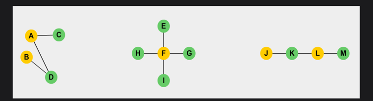
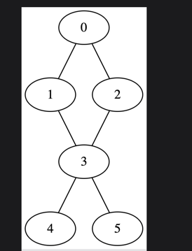
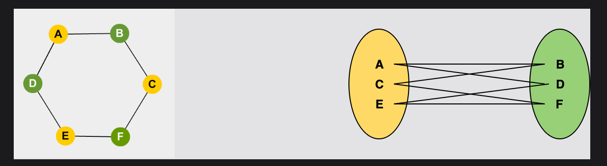
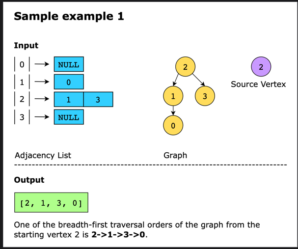
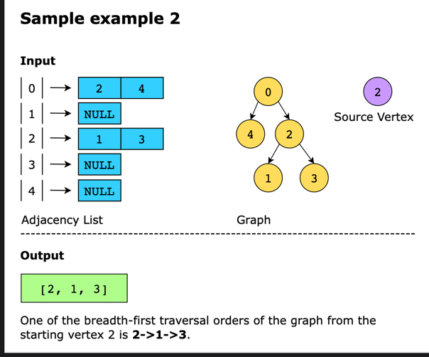
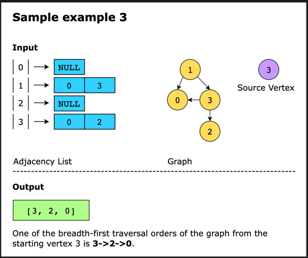

# Time Complexities of Graph Operations

Below, you can find the time complexities for the 4 basic graph functions.

**Note**: In this table, `V` means the total number of vertices and `E` means the total number of edges in the graph.

| Operation                | Adjacency List | Adjacency Matrix |
|--------------------------|----------------|------------------|
| **Add Vertex**            | O(1)           | O(V²)            |
| **Remove Vertex**         | O(V + E)       | O(V²)            |
| **Add Edge**              | O(1)           | O(1)             |
| **Remove Edge**           | O(E)           | O(1)             |
| **Search**                | O(V)           | O(1)             |
| **Breadth First Search (BFS)** | O(V + E) | O(V²)            |
| **Depth First Search (DFS)**  | O(V + E) | O(V²)            |

## Adjacency List

- **Add Edge**: Adding an edge in adjacency lists takes constant time `O(1)` as we only need to insert at the head node of the corresponding vertex.
  
- **Remove Edge**: Removing an edge takes `O(E)` time because, in the worst case, all the edges could be at a single vertex, requiring traversal of all `E` edges.

- **Remove Vertex**: Removing a vertex takes `O(V + E)` time because we need to delete all of its edges and reindex the list to fill the deleted spot.

- **Search Edge**: Searching for an edge between a pair of vertices can take up to `O(V)` if all `V` nodes are present at a certain index and need to be traversed.

## Adjacency Matrix

- **Edge Operations**: Performed in constant time `O(1)` since we only need to manipulate the value in the specific cell.
  
- **Vertex Operations**: Performed in `O(V²)` because we need to add rows and columns and fill the new cells.

- **Search Edge**: Searching an edge is `O(1)` since we can access each edge by indexing directly.

## Comparison

- **Adjacency List**: Suitable if your application frequently manipulates vertices.
- **Adjacency Matrix**: More efficient when dealing primarily with edges.

Keep these complexities in mind as they give you a better idea about the time complexities of various graph algorithms.

 # What is a Bipartite Graph?

In this section, we'll be introduced to a unique type of graph called the **bipartite graph**. We'll explore the concept with examples to understand it better.

## Table of Contents
1. [Introduction](#introduction)
2. [Can a Cyclic Graph be Bipartite?](#can-a-cyclic-graph-be-bipartite)
3. [Types of Bipartite Graphs](#types-of-bipartite-graphs)

## Introduction

A **bipartite graph** is a special type of graph where the set of vertices can be divided into two disjoint parts such that no two vertices within the same part are adjacent. 

- The bipartite graph is a subset of the more general **k-partite graph**, where **k = 2**. 
- In a 5-partite graph, for example, we would have 5 disjoint sets, and no members within a set would be adjacent to each other.

### Bipartite Graph Example

Below are some examples of bipartite graphs:

## Can a Cyclic Graph be Bipartite?

A **cyclic graph** is one in which edges form a cycle between vertices. If you traverse a cyclic graph, you will return to a vertex you have already visited.

For example:

### The Question: Can a Cyclic Graph be Bipartite?

**Yes**, a cyclic graph can be bipartite under certain conditions.

- If a cyclic graph has an **even number of vertices**, it can be divided into two disjoint sets such that no vertices in the same set are adjacent.
- If a cyclic graph has an **odd number of vertices**, it **cannot** be divided into two non-adjacent disjoint sets.

#### Example of Bipartite Cyclic Graph

Below is an example of a cyclic graph with an even number of vertices that can be divided into two disjoint sets:

This leads to an interesting observation:

- All **acyclic graphs** can be bipartite.
- **Cyclic graphs** must have an **even number of vertices** to be bipartite.

## Types of Bipartite Graphs

Some common types of bipartite graphs include:

1. **Star Graph**: A bipartite graph where one set contains a single vertex connected to all vertices in the other set.
2. **Acyclic Graph**
3. **Path graph**

# Types of Graph Traversals

Graph traversal means visiting every vertex in the graph. There are two basic techniques used for graph traversal:

1. **Breadth First Search (BFS)**
2. **Depth First Search (DFS)**

In order to understand these algorithms, we will have to view graphs from a slightly different perspective.

Any traversal needs a starting point, but a graph does not have a linear structure like lists or stacks. So how do we give graph traversal a better sense of direction?

This is where the concept of **levels** is introduced. Take any vertex as the starting point. This is the lowest level in your search. The next level consists of all the vertices adjacent to the starting vertex. A level higher would mean the vertices adjacent to the nodes at the lower level.

With this in mind, let’s begin our discussion on the two graph traversal algorithms.

---

## 1. Breadth First Search (BFS)

The BFS algorithm earns its name because it grows breadth-wise. All the nodes at a certain level are traversed before moving on to the next level.

The level-wise expansion ensures that for any starting vertex, you can reach all others, one level at a time.

## 2. Depth First Search (DFS)

The DFS algorithm is the opposite of BFS in the sense that it grows **depth-wise**.

Starting from any node, we keep moving to an adjacent node until we reach the farthest level. Then we move back to the starting point and pick another adjacent node. Once again, we probe to the farthest level and move back. This process continues until all nodes are visited.
