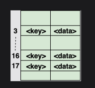
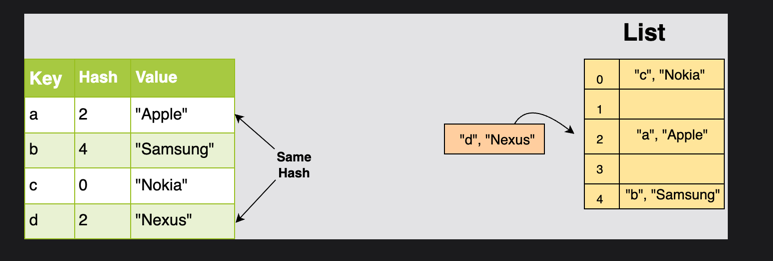
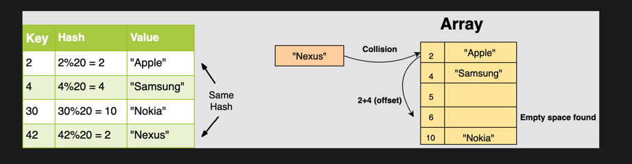
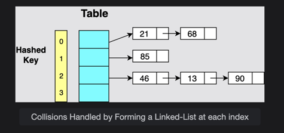

# Hashing in Coding Interviews

Until now, the overall time complexity accomplished by most of the data structures in insertion, deletion, and search was up to O(log n) or O(n log n), which is pretty good. But for a significantly large amount of data, this complexity starts to adversely affect the efficiency of an algorithm.

The ideal data structure is one that takes a constant amount of time to perform all three operations. And that is where **hashing** steps into the spotlight!

Hashing is a process used to store an object according to a **unique key**. This means that hashing always creates a **key-value pair**. A collection of such pairs forms a **dictionary** where every object or value can be looked up according to its key. Hence, the search operation can be performed in **O(1)**.

The concept of hashing has given birth to several new data structures, but the most prominent one is the **hash table**.

---

## Hash Tables

If your algorithm prioritizes search operations, then a **hash table** is the best data structure for you. In Python, hash tables are generally implemented using **lists** as they provide access to elements in constant time.

In Python, we have several in-built types such as **set** and **dict** which can provide us the hash table functionality.



In this section, we will implement our own hash table, which is a very popular topic in coding interviews.

### Fundamental Factors for Hash Table Performance

The performance of a hash table depends on three fundamental factors:
1. **Hash Function**: A function that maps keys to indices in the table.
2. **Size of the Hash Table**: The capacity of the hash table.
3. **Collision Handling Method**: A strategy to handle hash collisions when multiple keys hash to the same index.

# The Hash Function

The hash function is the first building block of a hash table. Let’s explore how it works and how we can efficiently map keys to values in a hash table.

## 1. Restricting the Key Size

In the previous lesson, we saw that a list can be used to implement a hash table in Python. A key is used to map a value to the list, and the efficiency of a hash table depends on how the key is computed.

At first glance, one might consider using the indices directly as keys because each index is unique. However, the main issue arises when the key exceeds the size of the list. When this happens, the list needs to be resized during each insertion, which is an expensive operation that takes **O(n)** time in the worst case.

In Python, resizing a list is syntactically easy, but the underlying process can slow down performance as the table grows. To overcome this limitation, we need a function that converts large keys into smaller ones that fit within the size of the hash table. This is the role of the **hash function**.

### Goal of a Hash Function:
A **hash function** takes an item's key and computes the corresponding index in the list where that item will be stored. Depending on the algorithm, the calculation can be as simple as arithmetic modulo operations, or more complex like encryption algorithms.

Choosing an efficient hash function is critical, as it directly impacts the performance of the hash table.

---

## 2. Common Hash Functions

Let’s look at some of the most commonly used hash functions.

### 2.1 Arithmetic Modular

In this approach, the hash function takes the key and computes the modulus with the size of the hash table (i.e., the list). This ensures that the index stays within the valid range of the table (from `0` to `table_size - 1`).

#### Formula:
```
index = key % table_size
```


#### Code Example:

```python
def hash_modular(key, size):
    return key % size

lst = [None] * 10  # List of size 10
key = 35
index = hash_modular(key, len(lst))  # Fit the key into the list size
print("The index for key " + str(key) + " is " + str(index))
```

### 2.2 Truncation

This method involves selecting a part of the key to use as the index rather than using the entire key. One common approach is to take the last few digits of the key.

Example:
For a key 123456, we can take the last 3 digits (456) to be used as the index.

#### Code Example:

```python
def hash_trunc(key):
    return key % 1000  # Will always give us a key of up to 3 digits

key = 123456
index = hash_trunc(key)  # Fit the key into the list size
print("The index for key " + str(key) + " is " + str(index))
```

### 2.3 Folding

In the folding method, we divide the key into small chunks and apply arithmetic operations like addition on these chunks. Afterward, the sum of all chunks is used as the hash value.

Example:
For a key 456789, if we choose a chunk size of 2, we divide the key into chunks like 45, 67, and 89, and then add them together to obtain the index.

#### Code Example:

```python
def hash_fold(key, chunk_size):  # Define the size of each divided portion
    str_key = str(key)  # Convert integer into string for slicing
    print("Key: " + str_key)
    hash_val = 0
    print("Chunks:")
    for i in range(0, len(str_key), chunk_size):
        if(i + chunk_size < len(str_key)):
            # Slice the appropriate chunk from the string
            print(str_key[i:i+chunk_size])
            hash_val += int(str_key[i:i+chunk_size])  # convert into integer
        else:
            print(str_key[i:len(str_key)])
            hash_val += int(str_key[i:len(str_key)])
    return hash_val

key = 3456789
chunk_size = 2
print("Hash Key: " + str(hash_fold(key, chunk_size)))
```

### 2.4 Mid-Square

In this method, we square the key and extract the middle digits as the hash value. This method is particularly useful when the key is a large number.

Example:
For a key 123456, we square it to get 15241383936. The middle digits are 4138, which we use as the index.

#### Code Example:

```python
def hash_mid_square(key):
    square = key * key
    str_square = str(square)
    mid = len(str_square) // 2
    return int(str_square[mid-1:mid+1])

```

# Collisions in Hash Tables

When you map large keys into a small range of numbers from 0-N, where N is the size of the list, there is a huge possibility that two different keys may return the same index. This phenomenon is called **collision**.


## Strategies to Handle Collisions

There are several ways to work around collisions in the list. The three most common strategies are:

1. **Linear Probing**
2. **Chaining**
3. **Resizing the List**

---

## 1. Linear Probing

This strategy suggests that if our hash function returns an index that is already filled, we move to the next index. This increment can be based on a fixed offset value to an already computed index. If that index is also filled, we traverse further until a free spot is found.



One drawback of using this strategy is that if we don’t pick an offset wisely, we can end up back where we started and miss out on many possible positions in the list.

### Example

Let’s say the size of our list is 20. We pass a key to the hash function, which takes the modular and returns 2.

If the second position is already filled, we jump to another location based on the offset value. Let’s say this value is 4. Now we reach the sixth position. If this is also occupied, we repeat the process and move to the tenth position, and so on.

---

## 2. Chaining

In the chaining strategy, each slot of our hash table holds a pointer to another data structure such as a linked list or a tree. Every entry at that index will be inserted into the linked list for that index.

As you can see, chaining allows us to hash multiple key-value pairs at the same index in constant time (insert at head for linked lists).

This strategy greatly increases performance, but it is costly in terms of space.



---

## 3. Resizing the List

Another way to reduce collisions is to resize the list. We can set a threshold, and once it is crossed, we can create a new table which is double the size of the original. All we have to do then is to copy the elements from the previous table.

Resizing the list significantly reduces collisions, but the function itself is costly. Therefore, we need to be careful about the threshold we set. A typical convention is to set the threshold at **0.6**, which means that when 60% of the table is filled, the resize operation needs to take place.

Another factor to keep in mind is the content of the hash table. The stored records might be concentrated in one region, leaving the rest of the list empty. However, this behavior will not be picked up by the resize function, and you will end up resizing inappropriately.

---

## Other Collision Handling Strategies

Some other strategies to handle collisions include **quadratic probing**, **bucket method**, **random probing**, and **key rehashing**. We must use a strategy that best suits our hashing algorithm and the size of the data that we plan to store.

# Overview

To sum up the discussion here, **hash tables** are the ideal data structure when you have a large amount of data and need all basic operations (search, insertion, and deletion) to work in constant time. However, the challenge with hash tables lies in deciding the optimized **hash function**. Additionally, the **large memory cost** associated with hash tables must also be considered.

## Time Complexities for Basic Hash Table Operations

Here are the time complexities for the basic hash table operations:

| **Operation** | **Average** | **Worst** |
|---------------|-------------|-----------|
| **Search**    | O(1)        | O(n)      |
| **Insertion** | O(1)        | O(n)      |
| **Deletion**  | O(1)        | O(n)      |

### Notes:
- **Average case:** In the average case, hash tables provide constant time complexity (O(1)) for search, insertion, and deletion operations when there are no collisions or the hash function distributes keys evenly.
- **Worst case:** In the worst case, when there are many collisions (or the hash table is poorly designed), these operations can degrade to O(n), where n is the number of elements in the table. This typically occurs if all keys hash to the same index, causing a long chain or cluster at that index.


# Comparison Between Trees and Hash Tables

Both of these data structures can be used for the same job, but their performance would vary based on the nature of your program. Let’s take a look at some of the factors we need to keep in mind when deciding on the appropriate data structure.

---

## 1. Basic Operations

On average, **hash tables** can perform search, insertion, and deletion in **constant time (O(1))**, whereas **trees** usually work in **O(log n)** time, where `n` is the number of elements. However, in the worst case, the performance of hash tables can degrade to **O(n)**, where `n` is the total number of hash entries, especially if many keys hash to the same index (causing collisions). 

On the other hand, a self-balancing tree like an **AVL tree** would maintain **O(log n)** time complexity even in the worst case because it ensures balanced tree height.

---

## 2. Hash Function

An efficient hash table requires a **smart hash function** that would distribute the keys evenly over all the available space. The choice of hash function significantly impacts the performance of the hash table, as a poor hash function can lead to excessive collisions, degrading performance.

In contrast, a tree is simpler to implement in this regard. It does not need a hash function. A tree accesses extra space only when necessary and adjusts the structure automatically (e.g., rebalancing in the case of AVL or Red-Black trees) to maintain efficient operations.

---

## 3. Order of Data

If your application needs data to be ordered in a specific sequence, **trees** would prove more useful. For instance, a **Binary Search Tree (BST)** or **AVL tree** maintains elements in a sorted order, and you can efficiently traverse or access elements in a sorted manner.

**Hash tables**, however, store data in an unordered fashion and are the smarter choice when order is not required. If your data can be stored randomly and accessed quickly, hash tables are a more efficient option.

---

## Conclusion

- **Hash Tables**: Best for scenarios where you need fast, constant-time access to elements, and order doesn't matter.
- **Trees**: Best for situations where data needs to be ordered, or you need to perform range queries or ordered traversals, with performance still being efficient at **O(log n)** in the worst case.


# Dictionary vs Set

Before solving any challenges regarding **Hash Tables**, it is necessary to look at the implementations of **dict** and **set** in Python and understand how they differ. It's a common misconception that these two structures are the same, but they are quite different from each other.

---

## 🔍 dict (Dictionary)

A **dict** or **dictionary** is a **Mapping Type** object which maps hashable values to arbitrary objects. It stores an element in the form of **key-value pairs**.

It provides the basic functionality of hashing along with some helper functions that help in the process of insertion, deletion, and search.

### Key Features of `dict`:

- A **dict** stores key-value pairs to map a key to a value:
    ```
    abc -> 123
    xyz -> 456
    ```

- **No duplicate keys**: A **`dict`** cannot contain duplicate keys, but it can have duplicate values.
  
- **Unordered storage**: A **`dict`** does not store elements in any order, either by the key or the value.  
  **Note**: From **Python 3.7** and above, the **insertion order** of elements is maintained.

- **Hash Table Implementation**: A **`dict`** uses a hash table for its implementation. It takes the key and then maps it into the range of the hash table using a **hash function**.

### Time Complexity:
- **Average Case**: **O(1)**  
- **Worst Case**: **O(n)** (in case of hash collisions)

## 🔍 set

A **set** is a container in Python that **does not allow duplicates**. It consists of elements in **no specific order**. Like `dict`, it is also built using a **hash table**, but it differs from a `dict` in terms of functionality and usage.

### Key Features of `set`:

- A **set** is a container that implements the **Set interface**, which only stores **values**, not key-value pairs. The value of each element in the set is treated as its own "key".
  
  Example:
  ```python
  1 -> 1
  abc -> abc
    ```
  
- **Unordered**: A set does not store elements in any specific order. The order of elements is **not guaranteed**.

- **Hash Table Implementation**: Like `dict`, a **set** is implemented using a **hash table**, where each value is hashed to a corresponding index.

### Time Complexity:
- **Average Case**: **O(1)** for operations like add, remove, and check membership.
- **Worst Case**: **O(n)** in the event of hash collisions.


## Member Functions

### Commonly Used Member Functions of `set`:

| Function            | Definition                                                                                   |
|---------------------|----------------------------------------------------------------------------------------------|
| `set1.add(element)`  | Adds the element to the set `set1`.                                                          |
| `set1.remove(element)` | Removes the element from the set `set1`. If the element is not found, it throws an error.  |
| `set1 - set2`        | Returns the **difference** between `set1` and `set2` (elements in `set1` but not in `set2`). |
| `set1 | set2`        | Returns the **union** of `set1` and `set2` (all unique elements from both sets).            |
| `set1 & set2`        | Returns the **intersection** of `set1` and `set2` (elements common to both sets).           |
| `key in container`   | Checks if the element `key` is present in the set. Returns `True` if found, `False` otherwise. |

### Commonly Used Member Functions of `dict`:

| Function              | Definition                                                                                       |
|-----------------------|--------------------------------------------------------------------------------------------------|
| `dict1[key] = value`  | Adds the `value` to the dictionary `dict1` mapped to the `key`.                                  |
| `del dict1[key]`      | Removes the key-value pair from `dict1` with the given `key`.                                    |
| `key in dict1`        | Checks if the `key` is present in the dictionary. Returns `True` if found, `False` otherwise.    |

