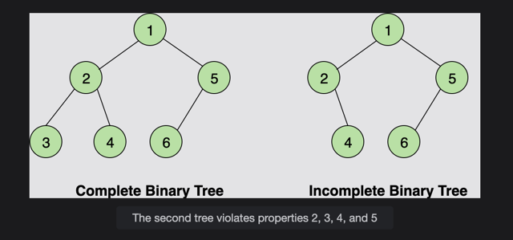
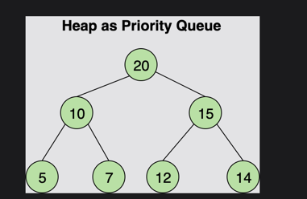
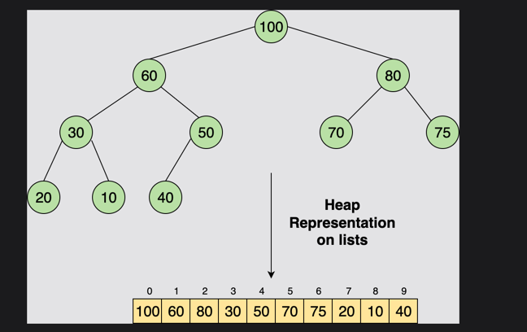

# Introduction

**Heaps** are advanced data structures that are useful in applications such as sorting and implementing priority queues. They are regular binary trees with two special properties:

1. **Heaps must be Complete Binary Trees**  
   A Complete Binary Tree is a tree where each node has at most two children, and the nodes at all levels are full, except for the leaf nodes, which can be empty.

---

## Some Complete Binary Tree Properties:

- All leaves are either at depth **d** or depth **d − 1**.
- The leaves at depth **d** are to the left of the leaves at depth **d − 1**.
- There is at most one node with just one child.
  - If the singular child exists, it is the **left child** of its parent.
  - If the singular child exists, it is the **rightmost leaf** at depth **d**.





# The Heap Order Property

The nodes must be ordered according to the **Heap Order Property**. The heap order property is different for the two heap structures that we are going to study in this chapter:

1. **Min Heap**
2. **Max Heap**

Min Heaps are built based upon the **Min Heap Property**, and Max Heaps are built based upon the **Max Heap Property**. Let’s see how they are different.

---

## Max Heap Property

- All the parent node keys must be **greater than or equal to** their child node keys in max-heaps.  
- Therefore, the root node will always contain the **largest element** in the Heap.  

If Node A has a child node B, then:

- The key of A is greater than or equal to the key of B.


---

## Min Heap Property

- In Min-Heaps, all the parent node keys must be **less than or equal to** their child node keys.  
- Therefore, the root node will always contain the **smallest element** in the Heap.  

If Node A has a child node B, then:

- The key of A is less than or equal to the key of B.


---

## Where are Heaps Used?

The primary purpose of heaps is to return the **smallest or largest element**.  
This is because the time complexity of getting the minimum/maximum value from a min/max heap is **O(1)**, i.e., constant time complexity.  

This property is leveraged in algorithms that require frequent retrieval of the maximum/minimum value, making heaps an important data structure. Heaps are also widely used to design **Priority Queues**.

Some of the famous algorithms implemented using heaps include:

- **Prim’s Algorithm**
- **Dijkstra’s Algorithm**
- **Heap Sort Algorithm** (entirely based on the Heap data structure)




# Heap Representation in Lists

Heaps can be implemented using **arrays** or **lists** in Python. The node values are stored such that:

1. All the **parent nodes** occur in the **first half** of the list (where `index ≤ floor((n−1)/2)` where `n` is the last index).
2. The **leaves** exist in the rest of the list.

### Key Observations:
- The last parent node will be at the index `floor((n−1)/2)`.
- For the node at the `kth` index:
  - The **left child** is at index `2k+1`.
  - The **right child** is at index `2k+2`.

To put it simply, the index of each node corresponds to the position you'd count if you started at `0` from the root and went **left to right level-wise** in the tree.

---

### Illustration of List Representation

Here is a figure showing how nodes in a tree are mapped to a list:




As you can see, all the parent nodes are present in the first half of the list, and the last parent appears at the floor(n/2) position. In this case, `n` is the last or largest index, so:

- **n = 9**

To find the last parent node, we use the formula:

- **floor((n - 1) / 2) = floor(8 / 2) = floor(4) = 4**

So, the last parent is at the 4th index, the key of which is **50**. The children nodes appear in the second half of the list. The following two properties also hold for the children of any node:

- **Left Child = 2k + 1**
- **Right Child = 2k + 2**

Where `k` is the index of the parent node.

#### Example
If we take `k = 4`:
- The **left child** will be at index `2 * 4 + 1 = 9`
- The **right child** will be at index `2 * 4 + 2 = 10`

Thus, the child nodes are calculated using these properties, and they continue to follow this relationship throughout the structure of the heap.

### Common Misconceptions about Heaps

Heaps are sometimes referred to as **Binary Heaps** because they are, in fact, binary trees. However, it's important to clarify several common misconceptions regarding Heaps:

1. **Heaps are Not the Same as Heap Memory**:
   The Heap data structure should not be confused with heap memory. Heap memory refers to a region of computer memory used for dynamic allocation, whereas the Heap data structure is a specific type of binary tree that is used to efficiently implement priority queues.

2. **Elements of Heaps Are Not Sorted**:
   It is often incorrectly believed that the elements in a Heap are sorted. In reality, Heaps do not maintain a fully sorted order among all their elements. The only condition they must follow is that the **largest** (in a Max-Heap) or the **smallest** (in a Min-Heap) element is always at the top of the Heap, which is the root node. This condition ensures that Heaps can efficiently provide access to the maximum or minimum element but does not imply any further sorting of the remaining elements.

3. **Binary Structure and Heap Properties**:
   A Heap is a binary tree that is **complete**, meaning all levels except possibly the last are completely filled, and all nodes are as left-leaning as possible. The Heap property ensures that for every parent node, the value of the parent is either greater than or equal to (Max-Heap) or less than or equal to (Min-Heap) the values of its children. However, this does not imply a specific ordering of nodes beyond the parent-child relationship.

These misconceptions can lead to confusion, especially when distinguishing between sorting mechanisms and the primary purpose of the Heap, which is to provide quick access to the maximum or minimum element for efficient operations such as insertions or deletions.

### Building a Max-Heap

As mentioned in the previous lesson, max-heaps follow the **max heap property**, which means that the key at the parent node is always greater than the keys at the child nodes. Heaps can be implemented using lists or using node and tree classes. However, they are generally implemented using lists or arrays, as this is the more space-efficient approach! To build a heap, start with an empty one and successively **insert()** all the elements.

For a visual demonstration of heap creation, check out the following illustration.

#### Insertion in a Max-Heap
Here is a high-level description of the algorithm to insert elements into a heap and maintain the heap property:

1. **Create a new child node at the end of the heap**.
2. **Place the new key at that node**.
3. **Restore the heap property by swapping parent and child values if the parent key is smaller than the child key**. This process is called **percolating up**.
4. **Continue to percolate up until the heap property is restored**.

For a clearer picture, here’s a visual representation of inserting into a max-heap:

**Example: Insert 35, 40, 15, 50 into an Existing Max-Heap**

**Example: Insert 30 into an Existing Max-Heap**

**Initial Heap (Tree Representation)**: 
```
       20
      /   \
    8      15
   / \    /
  5   1  2
```

1. **Add 30 as a New Child Node**: 
   - Insert `30` as the left child of `15` since it is the next available spot to maintain the heap structure.
```
       20
      /   \
    8      15
   / \    / \
  5   1  2  30
```

2. **Percolate Up (Restoring the Heap Property)**: 
   - Compare `30` with its parent node (`15`). Since `30 > 15`, swap them.
```
       20
      /   \
    8      30
   / \    / \
  5   1  2  15
```

3. **Continue Percolating Up**: 
   - Now, compare `30` with its new parent (`20`). Since `30 > 20`, swap them.
```
       30
      /   \
    8      20
   / \    / \
  5   1  2  15
```

**Final Heap After Insertion of 30**: 
```
       30
      /   \
    8      20
   / \    / \
  5   1  2  15
```

### Remove Maximum in a Max-Heap
Here is the algorithm that you will follow to ensure the heap property still holds after deleting the root element:

1. **Delete the root node**.
2. **Move the key of the last child node at the last level to the root**.
3. **Compare the key with its children, and if the key is smaller than the key at any of the child nodes, swap values**. This process is called **max heapifying**.
4. **Continue to max heapify until the heap property is restored**.

For better understanding, here’s a visual representation of the removal process in a max-heap:


In this example, we will delete the root node from the following max-heap.

**Initial Heap (Tree Representation)**:
```
       20
      /   \
    8      15
   / \    /
  5   1  2
```

#### Step-by-Step Deletion of the Root Node (20)

1. **Remove the Root Node (20)**:
   - The root node (`20`) is removed from the heap.
   - To maintain the complete tree property, move the last element (`2`) to the root.
   - Heap after moving last element to root:
```
       2
      /   \
    8      15
   / \   
  5   1
   ```

2. **Max Heapify to Restore the Heap Property**:
   - Compare the new root (`2`) with its children (`8` and `15`). Since `15` is the largest, swap `2` with `15`.
   - Heap after first swap:
```
       15
      /   \
    8      2
   / \   
  5   1
   ```

3. **Continue Max Heapify**:
   - Now, `2` has no children larger than itself, so the heap property is restored.

**Final Heap After Deletion of Root Node (20)**:
```
       15
      /   \
    8      2
   / \   
  5   1
```


### Building a Min-Heap

Min-heaps follow the **min heap property**, which means that the key at the parent node is always less than the keys at the child nodes. To build a min-heap, start with an empty one and successively **insert()** all the elements.

For a visual demonstration of heap creation, check out the following illustration.

#### Insert

Here is a high-level description of the algorithm to insert elements into a heap and maintain the heap property:

1. **Create a new child node at the end of the heap**.
2. **Place the new key at that node**.
3. **Restore the heap property by swapping parent and child values if the parent key is greater than the child key**. This process is called **percolating up**.
4. **Continue to percolate up until the heap property is restored**.
5. **Example: Insert 35, 40, 15, 50 into an Existing Min-Heap**
6. **Example: Insert 30 into an Existing Min-Heap**
7. **Initial Heap (Tree Representation)**:
```
       1
      /   \
    5      2
   / \    /
  8   15 20
```

1. **Add 30 as a New Child Node**:
   - Insert `30` as the left child of `20` since it is the next available spot to maintain the heap structure.
```
       1
      /   \
    5      2
   / \    / \
  8   15 20  30
```

2. **Percolate Up (Restoring the Heap Property)**:
   - Compare `30` with its parent node (`20`). Since `30 > 20`, swap them.
```
       1
      /   \
    5      2
   / \    / \
  8   15 30  20
```

3. **Continue Percolating Up**:
   - Now, compare `30` with its new parent (`2`). Since `30 > 2`, swap them.
```
       1
      /   \
    5      30
   / \    / \
  8   15 2  20
```

**Final Heap After Insertion of 30**:
```
       1
      /   \
    5      30
   / \    / \
  8   15 2  20
```

### Remove Minimum in a Min-Heap

Here is the algorithm that you will follow to ensure the heap property still holds after deleting the root element:

1. **Delete the root node**.
2. **Move the key of the last child node at the last level to the root**.
3. **Compare the key with its children, and if the key is larger than the key at any of the child nodes, swap values**. This process is called **min heapifying**.
4. **Continue to min heapify until the heap property is restored**.
5. **Example: Remove the Root Node (1) from the Min-Heap**
6. **Initial Heap (Tree Representation)**:
```
       1
      /   \
    5      2
   / \    /
  8   15 20
```

#### Step-by-Step Deletion of the Root Node (1)

1. **Remove the Root Node (1)**:
   - The root node (`1`) is removed from the heap.
   - To maintain the complete tree property, move the last element (`30`) to the root.
   - Heap after moving last element to root:
```
       30
      /   \
    5      2
   / \   
  8   15
   ```

2. **Min Heapify to Restore the Heap Property**:
    - Compare the new root (`30`) with its children (`5` and `2`). Since `2` is the smallest, swap `30` with `2`.
    - Heap after first swap:
    ```
         2
        /   \
     5      30
    / \   
      8   15
    ```
   
3. **Continue Min Heapify**:
4. - Now, `2` has no children smaller than itself, so the heap property is restored.
- **Final Heap After Deletion of Root Node (1)**:
```
       2
      /   \
    5      30
   / \   
  8   15
```


