# Trees in Data Structures

Trees consist of **vertices (nodes)** and **edges** that connect them. Unlike the linear data structures that we have studied so far, trees are **hierarchical**. They are similar to **Graphs**, except that a cycle cannot exist in a Tree - they are **acyclic**. In other words, there is always exactly **one path** between any two nodes.

## Key Terminologies in Trees

- **Root Node**: A node with no parent nodes. Generally, trees don’t have to have a root. However, rooted trees have one distinguished node and are largely what we will use in this course.
- **Child Node**: A Node which is linked to an upper node (Parent Node).
- **Parent Node**: A Node that has links to one or more Child Nodes.
- **Sibling Node**: Nodes that share the same Parent Node.
- **Leaf Node**: A node that doesn’t have any Child Node.
- **Ancestor Nodes**: The nodes on the path from a node _d_ to the root node. Ancestor nodes include node _d’s_ parents, grandparents, and so on.

### Additional Tree Terminologies

- **Sub-tree**: For a particular non-leaf node, a collection of nodes, essentially the tree, starting from its child node. The tree formed by a node and its descendants.
- **Degree of a node**: Total number of children of a node.
- **Length of a path**: The number of edges in a path.
- **Depth of a node _n_**: The length of the path from a node _n_ to the root node. The depth of the root node is 0.
- **Level of a node _n_**: (Depth of a Node) + 1.
- **Height of a node _n_**: The length of the path from _n_ to its deepest descendant. So, the height of the tree itself is the height of the root node, and the height of leaf nodes is always 0.
- **Height of a Tree**: Height of its root node.

## Types of Trees

Many different types of trees exist which are optimized for particular use cases. Each tree type offers its own particular structure and hence space-time complexity for different operations. Some commonly used trees include:

- **Binary Trees**
- **Binary Search Trees**
- **AVL Trees**
- **Red-Black Trees**
- **2-3 Trees**

We’ll study each of these types in detail in upcoming chapters!

## The N-ary Tree

In graph theory, an **N-ary tree** is a rooted tree in which each node has no more than **N children**. It is also sometimes known as a **k-way tree**, a **k-ary tree**, or an **M-ary tree**. A **binary tree** is a special case where _k=2_, so they can have a maximum of 2 child nodes and a minimum of 0 child nodes. Binary trees are used extensively in a plethora of important algorithms!


# What Makes a Tree 'Balanced'?

A **binary tree** is considered **height-balanced** if, for each node in the tree, the difference between the height of the right subtree and the left subtree is at most one.

| Height(LeftSubTree) - Height(RightSubTree) | ≤ 1


Look at the illustration below of a height-balanced tree. Notice how the left and right sub-trees all appear at the same height.

## High-level Algorithm to Determine if a Tree is Height-Balanced

1. **Start from the leaf nodes and move towards the root.**
   
2. **Compute the heights** of the left-subtree and right-subtree of each node as you traverse the tree. The height of a leaf node is always 0.

3. **Check at each node**: If the difference between the height of the left and right sub-tree is more than 1, the tree is not balanced.

4. **Final check**: If you have traversed the entire tree and haven’t encountered the above condition, then the tree is balanced.

Q. Find if the following tree is balanced:

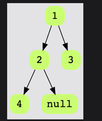

Hint: The tree is balanced if the difference between the height of the left and right sub-trees is at most 1.

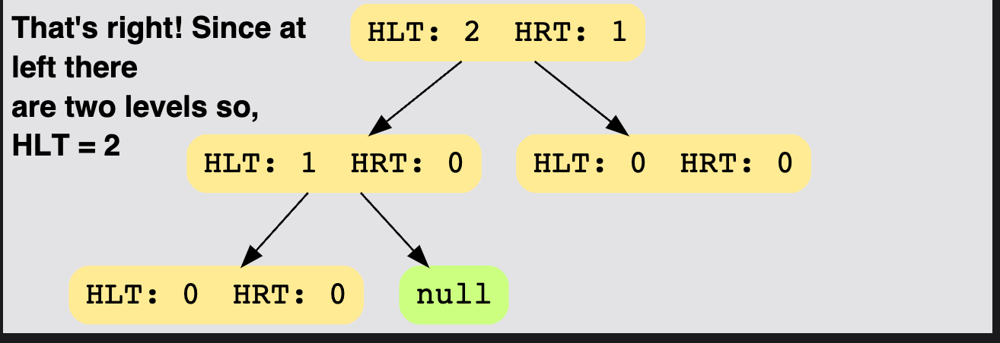

Ans: Yes


Q. Find if the following tree is balanced:

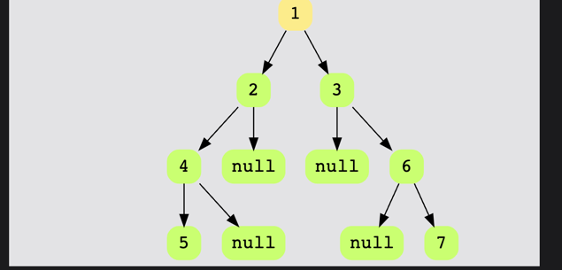

Hint: Observe node 2. The difference between the height of the left and right sub-trees is 2. 
Hence, the tree is not balanced.

Ans: No

# What is a Binary Tree?

A **binary tree** is a tree in which each node has between 0-2 children. These children are called the **left** and **right** children of the node. The figure below shows what a Binary Tree looks like.

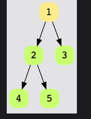
## Types of Binary Trees

### 1. Complete Binary Trees
A **complete binary tree** is a binary tree in which all the levels of the tree are fully filled, except for perhaps the last level, which can be filled from left to right.

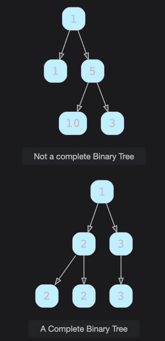

### 2. Full Binary Trees
In a **full** or ‘proper’ binary tree, every node has either 0 or 2 children. No node can have exactly 1 child.

The total number of nodes in a full binary tree of height ‘h’ can be expressed as:

2^h + 1 ≤ total number of nodes ≤ 2^(h+1) - 1

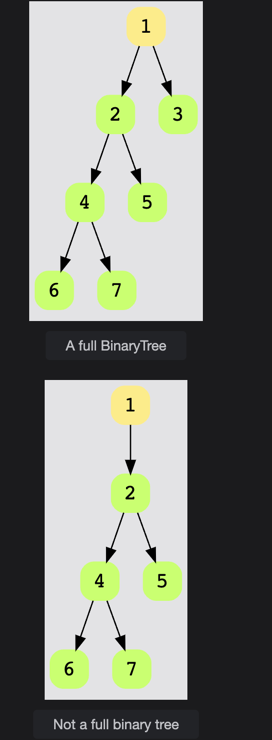

### 3. Perfect Binary Trees
A binary tree is said to be **perfect** if all its internal nodes have two children, and all leaves are at the same level. 

The total number of nodes in a perfect binary tree of height ‘h’ is given by:

2^(h+1) - 1

The total number of leaf nodes in a perfect binary tree is given by:

2^h or 2^(n+1)

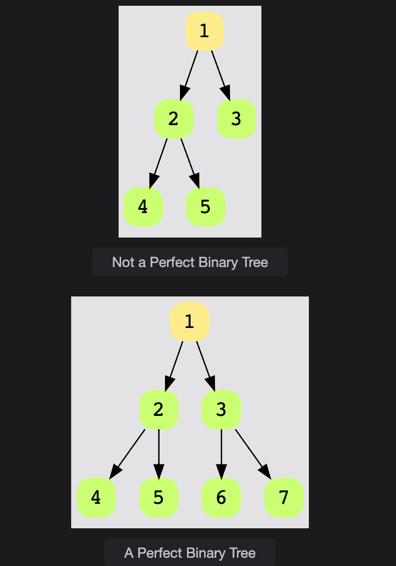

# More on Complete Binary Trees

## Introduction

Here are some more detailed properties of **complete binary trees**:

- All the levels are completely filled except possibly the last one.
- Nodes at the last level are as far left as possible.

## Properties

### 1. Total Number of Nodes

The total number of nodes, `n`, in a complete binary tree of height `h` is expressed as:

2^h ≤ n ≤ 2^(h+1) - 1


This is based on the Geometric Series formula:

1 + 2 + 4 + 8 + ... + 2^h = 2^(h+1) - 1

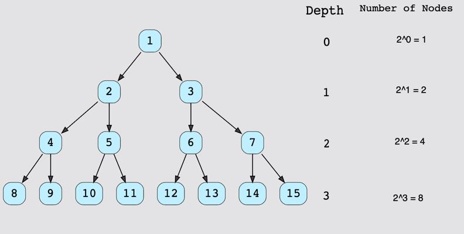

### 2. Total Number of Non-leaf Nodes

The total number of non-leaf nodes, `n_i`, in a complete binary tree of height `h` is expressed as a range like so:

2^(h-1) ≤ n_i ≤ 2^h - 1


### 3. Total Number of Leaf Nodes

The total number of leaf nodes, `n_e`, in a complete binary tree of height `h` is expressed as a range like so:

2^(h-1) ≤ n_e ≤ 2^h


### 4. Nodes Range

The total number of nodes, `n`, in a complete binary tree of height `h` is present in the following range:

2^h ≤ n ≤ 2^(h+1) - 1

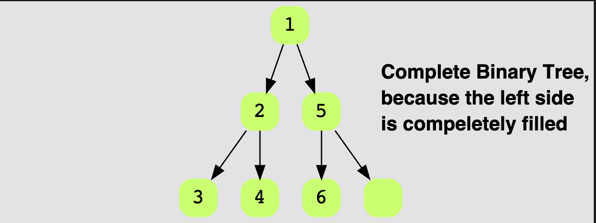
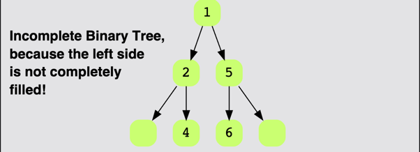

# Insertion in Complete Binary Trees

The following rules apply when inserting a value into a **Complete Binary Tree**:

1. **Nodes are inserted level by level.**
   - This ensures that the tree remains complete, meaning that each level is filled from left to right before moving to the next level.

2. **Fill in the left-subtree before moving to the right one.**
   - When inserting a new node, always check for an empty left child first. If the left child is empty, insert the node there. If the left child is occupied, only then move to the right child.

3. **No node can have a right child without a left child.**
   - In a Complete Binary Tree, no node will have a right child if it doesn’t already have a left child. So, during insertion, always ensure the left child is filled first.

### Key Point

- During the insertion process, always prioritize filling the left subtree of any node. Only when the left child is occupied, move to the right child. This keeps the tree complete and balanced, maintaining the required properties of the tree.

# Skewed Binary Trees

**Skewed Binary Trees** are binary trees where all the nodes, except one, have only one child. All of the children nodes are either left or right child nodes, so the entire tree is positioned either to the left or the right side. This type of binary tree structure should be avoided at all costs because the time complexity of most operations will be high due to the linear structure, making it inefficient.

## Types of Skewed Binary Trees

### 1. Left-Skewed Binary Trees
A **left-skewed binary tree** has all nodes as left child nodes. This means that each node, except the last one, has only a left child and no right child.

### 2. Right-Skewed Binary Trees
A **right-skewed binary tree** has all nodes as right child nodes. Each node, except the last one, has only a right child and no left child.

### Key Concern
- **Efficiency**: Skewed binary trees degrade the efficiency of most operations like search, insertion, and deletion, as they essentially behave like a linked list. The time complexity for these operations can grow to O(n) in the worst case, where `n` is the number of nodes.

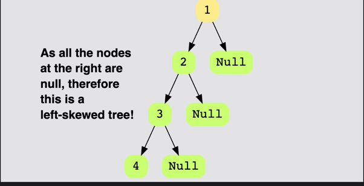
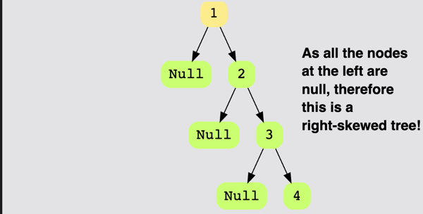

# What is a Binary Search Tree (BST)?

**Binary Search Trees (BSTs)** are a special kind of binary tree where each node contains **key-value pairs**. These key-value pairs can represent anything, such as:

- `(username, bank)`
- `(employee, employeeID)`

## Binary Search Tree Rule

For all nodes in a **BST**, the values follow the **BST Rule**:

1. The values of all the keys in the **left subtree** of a node are **less than or equal** to the value of the node itself.
2. The values of all the keys in the **right subtree** of a node are **greater than** the value of the node itself.

This can be represented as:

NodeValues(leftsubtree) <= CurrentNodeValue < NodeValues(rightsubtree)


### Key Characteristics:

- The BST rule ensures that for any node, the left child and its descendants contain smaller or equal values, while the right child and its descendants contain larger values.
- This ordering allows efficient searching, insertion, and deletion operations, making **BSTs** widely used in applications that require dynamic data management.

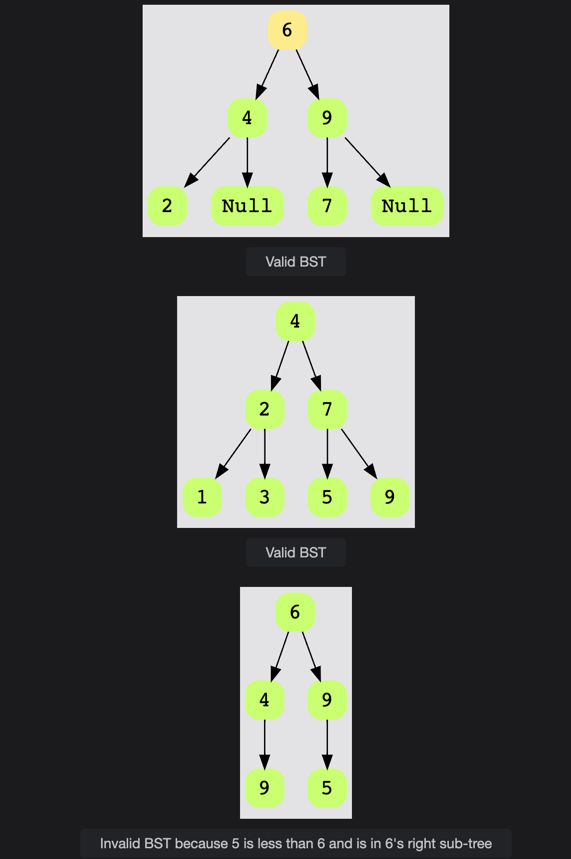

# Binary Search Trees (BSTs) vs. Binary Trees

Not every **binary tree** is a **Binary Search Tree (BST)**. Although a **BST** is a type of binary tree, not all binary trees qualify as BSTs. Some people mistakenly assume that every binary tree must be a binary search tree, but this is not the case.

For a binary tree to qualify as a **binary search tree**, it needs to follow the **BST property**, which ensures:

1. The values of all nodes in the **left subtree** of a node are **less than or equal** to the value of the node itself.
2. The values of all nodes in the **right subtree** of a node are **greater than** the value of the node itself.

If a binary tree doesn’t follow this rule, it cannot be classified as a **Binary Search Tree**.

## Example: Why Every Binary Tree is Not a Binary Search Tree


## Key Takeaway:

- **Binary Trees** are a more general structure and they don't have any specific property related to the ordering of node values.
- **Binary Search Trees** are a special type of binary tree that follows the ordering rule (BST property), which allows for efficient searching, insertion, and deletion operations.


# Initializing a Binary Search Tree (BST)

## The Node Class

To implement a **Binary Search Tree (BST)**, the first step is to create a **Node**. A node should have the following attributes:

- **Value**: The data or key held by the node.
- **Left Child**: A reference to the left child node.
- **Right Child**: A reference to the right child node.
- **Parent**: A reference to the parent node (optional but can be useful).

Here is a basic representation of a `Node` class:

```python
class Node:
    def __init__(self, value):
        self.value = value
        self.left = None
        self.right = None
        self.parent = None
```
You can then choose to create a wrapper class for the tree itself; this can sometimes make your code cleaner and easier to read, but not always.

```python
class BinarySearchTree:
    def __init__(self, val):  # Initializes a root node
        self.root = Node(val)
```

Putting the two together:

```python
from Node import Node  # use `Node` class from Node.py


class BinarySearchTree:
    def __init__(self, val):  # Initializes a root node
        self.root = Node(val)


BST = BinarySearchTree(6)  # Initializes a BST
print(BST.root.val)  # print value of root node
```

# Binary Search Tree Insertion Algorithm

Here is a description of the algorithm used to insert a new value into a **Binary Search Tree (BST)**:

1. **Start from the root node**.
   
2. **Compare the value to be inserted** with the current node’s value:
   - If the value to be inserted is **greater** than the root/current node’s value, move to the **right subtree**.
   - If the value to be inserted is **less than or equal to** the root/current node’s value, move to the **left subtree**.

3. **Repeat the comparison**:
   - Keep comparing the value with the current node’s value and move to the appropriate subtree (left or right) until you reach a node that has no corresponding child.

4. **Insert the new value**:
   - When you find a node that does not have the required left or right child, insert the new value at that position as a new child.
   - Update the parent node to reference the newly inserted node.

## Summary of the Steps:

- Start at the root.
- Compare the value to be inserted with the current node.
- Move left or right based on comparison.
- Insert the value when you find an empty left or right child.
- Update the parent node accordingly.


