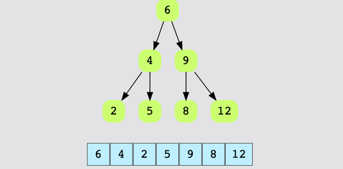

# Trees in Data Structures

Trees consist of **vertices (nodes)** and **edges** that connect them. Unlike the linear data structures that we have studied so far, trees are **hierarchical**. They are similar to **Graphs**, except that a cycle cannot exist in a Tree - they are **acyclic**. In other words, there is always exactly **one path** between any two nodes.

## Key Terminologies in Trees

- **Root Node**: A node with no parent nodes. Generally, trees don’t have to have a root. However, rooted trees have one distinguished node and are largely what we will use in this course.
- **Child Node**: A Node which is linked to an upper node (Parent Node).
- **Parent Node**: A Node that has links to one or more Child Nodes.
- **Sibling Node**: Nodes that share the same Parent Node.
- **Leaf Node**: A node that doesn’t have any Child Node.
- **Ancestor Nodes**: The nodes on the path from a node _d_ to the root node. Ancestor nodes include node _d’s_ parents, grandparents, and so on.

### Additional Tree Terminologies

- **Sub-tree**: For a particular non-leaf node, a collection of nodes, essentially the tree, starting from its child node. The tree formed by a node and its descendants.
- **Degree of a node**: Total number of children of a node.
- **Length of a path**: The number of edges in a path.
- **Depth of a node _n_**: The length of the path from a node _n_ to the root node. The depth of the root node is 0.
- **Level of a node _n_**: (Depth of a Node) + 1.
- **Height of a node _n_**: The length of the path from _n_ to its deepest descendant. So, the height of the tree itself is the height of the root node, and the height of leaf nodes is always 0.
- **Height of a Tree**: Height of its root node.

## Types of Trees

Many different types of trees exist which are optimized for particular use cases. Each tree type offers its own particular structure and hence space-time complexity for different operations. Some commonly used trees include:

- **Binary Trees**
- **Binary Search Trees**
- **AVL Trees**
- **Red-Black Trees**
- **2-3 Trees**

We’ll study each of these types in detail in upcoming chapters!

## The N-ary Tree

In graph theory, an **N-ary tree** is a rooted tree in which each node has no more than **N children**. It is also sometimes known as a **k-way tree**, a **k-ary tree**, or an **M-ary tree**. A **binary tree** is a special case where _k=2_, so they can have a maximum of 2 child nodes and a minimum of 0 child nodes. Binary trees are used extensively in a plethora of important algorithms!


# What Makes a Tree 'Balanced'?

A **binary tree** is considered **height-balanced** if, for each node in the tree, the difference between the height of the right subtree and the left subtree is at most one.

| Height(LeftSubTree) - Height(RightSubTree) | ≤ 1


Look at the illustration below of a height-balanced tree. Notice how the left and right sub-trees all appear at the same height.

## High-level Algorithm to Determine if a Tree is Height-Balanced

1. **Start from the leaf nodes and move towards the root.**
   
2. **Compute the heights** of the left-subtree and right-subtree of each node as you traverse the tree. The height of a leaf node is always 0.

3. **Check at each node**: If the difference between the height of the left and right sub-tree is more than 1, the tree is not balanced.

4. **Final check**: If you have traversed the entire tree and haven’t encountered the above condition, then the tree is balanced.

Q. Find if the following tree is balanced:


Hint: The tree is balanced if the difference between the height of the left and right sub-trees is at most 1.


Ans: Yes


Q. Find if the following tree is balanced:


Hint: Observe node 2. The difference between the height of the left and right sub-trees is 2. 
Hence, the tree is not balanced.

Ans: No

# What is a Binary Tree?

A **binary tree** is a tree in which each node has between 0-2 children. These children are called the **left** and **right** children of the node. The figure below shows what a Binary Tree looks like.


## Types of Binary Trees

### 1. Complete Binary Trees
A **complete binary tree** is a binary tree in which all the levels of the tree are fully filled, except for perhaps the last level, which can be filled from left to right.


### 2. Full Binary Trees
In a **full** or ‘proper’ binary tree, every node has either 0 or 2 children. No node can have exactly 1 child.

The total number of nodes in a full binary tree of height ‘h’ can be expressed as:

2^h + 1 ≤ total number of nodes ≤ 2^(h+1) - 1


### 3. Perfect Binary Trees
A binary tree is said to be **perfect** if all its internal nodes have two children, and all leaves are at the same level. 

The total number of nodes in a perfect binary tree of height ‘h’ is given by:

2^(h+1) - 1

The total number of leaf nodes in a perfect binary tree is given by:

2^h or 2^(n+1)


# More on Complete Binary Trees

## Introduction

Here are some more detailed properties of **complete binary trees**:

- All the levels are completely filled except possibly the last one.
- Nodes at the last level are as far left as possible.

## Properties

### 1. Total Number of Nodes

The total number of nodes, `n`, in a complete binary tree of height `h` is expressed as:

2^h ≤ n ≤ 2^(h+1) - 1


This is based on the Geometric Series formula:

1 + 2 + 4 + 8 + ... + 2^h = 2^(h+1) - 1


### 2. Total Number of Non-leaf Nodes

The total number of non-leaf nodes, `n_i`, in a complete binary tree of height `h` is expressed as a range like so:

2^(h-1) ≤ n_i ≤ 2^h - 1


### 3. Total Number of Leaf Nodes

The total number of leaf nodes, `n_e`, in a complete binary tree of height `h` is expressed as a range like so:

2^(h-1) ≤ n_e ≤ 2^h


### 4. Nodes Range

The total number of nodes, `n`, in a complete binary tree of height `h` is present in the following range:

2^h ≤ n ≤ 2^(h+1) - 1


# Insertion in Complete Binary Trees

The following rules apply when inserting a value into a **Complete Binary Tree**:

1. **Nodes are inserted level by level.**
   - This ensures that the tree remains complete, meaning that each level is filled from left to right before moving to the next level.

2. **Fill in the left-subtree before moving to the right one.**
   - When inserting a new node, always check for an empty left child first. If the left child is empty, insert the node there. If the left child is occupied, only then move to the right child.

3. **No node can have a right child without a left child.**
   - In a Complete Binary Tree, no node will have a right child if it doesn’t already have a left child. So, during insertion, always ensure the left child is filled first.

### Key Point

- During the insertion process, always prioritize filling the left subtree of any node. Only when the left child is occupied, move to the right child. This keeps the tree complete and balanced, maintaining the required properties of the tree.

# Skewed Binary Trees

**Skewed Binary Trees** are binary trees where all the nodes, except one, have only one child. All of the children nodes are either left or right child nodes, so the entire tree is positioned either to the left or the right side. This type of binary tree structure should be avoided at all costs because the time complexity of most operations will be high due to the linear structure, making it inefficient.

## Types of Skewed Binary Trees

### 1. Left-Skewed Binary Trees
A **left-skewed binary tree** has all nodes as left child nodes. This means that each node, except the last one, has only a left child and no right child.

### 2. Right-Skewed Binary Trees
A **right-skewed binary tree** has all nodes as right child nodes. Each node, except the last one, has only a right child and no left child.

### Key Concern
- **Efficiency**: Skewed binary trees degrade the efficiency of most operations like search, insertion, and deletion, as they essentially behave like a linked list. The time complexity for these operations can grow to O(n) in the worst case, where `n` is the number of nodes.


# What is a Binary Search Tree (BST)?

**Binary Search Trees (BSTs)** are a special kind of binary tree where each node contains **key-value pairs**. These key-value pairs can represent anything, such as:

- `(username, bank)`
- `(employee, employeeID)`

## Binary Search Tree Rule

For all nodes in a **BST**, the values follow the **BST Rule**:

1. The values of all the keys in the **left subtree** of a node are **less than or equal** to the value of the node itself.
2. The values of all the keys in the **right subtree** of a node are **greater than** the value of the node itself.

This can be represented as:

NodeValues(leftsubtree) <= CurrentNodeValue < NodeValues(rightsubtree)


### Key Characteristics:

- The BST rule ensures that for any node, the left child and its descendants contain smaller or equal values, while the right child and its descendants contain larger values.
- This ordering allows efficient searching, insertion, and deletion operations, making **BSTs** widely used in applications that require dynamic data management.


# Binary Search Trees (BSTs) vs. Binary Trees

Not every **binary tree** is a **Binary Search Tree (BST)**. Although a **BST** is a type of binary tree, not all binary trees qualify as BSTs. Some people mistakenly assume that every binary tree must be a binary search tree, but this is not the case.

For a binary tree to qualify as a **binary search tree**, it needs to follow the **BST property**, which ensures:

1. The values of all nodes in the **left subtree** of a node are **less than or equal** to the value of the node itself.
2. The values of all nodes in the **right subtree** of a node are **greater than** the value of the node itself.

If a binary tree doesn’t follow this rule, it cannot be classified as a **Binary Search Tree**.

## Example: Why Every Binary Tree is Not a Binary Search Tree


## Key Takeaway:

- **Binary Trees** are a more general structure and they don't have any specific property related to the ordering of node values.
- **Binary Search Trees** are a special type of binary tree that follows the ordering rule (BST property), which allows for efficient searching, insertion, and deletion operations.


# Initializing a Binary Search Tree (BST)

## The Node Class

To implement a **Binary Search Tree (BST)**, the first step is to create a **Node**. A node should have the following attributes:

- **Value**: The data or key held by the node.
- **Left Child**: A reference to the left child node.
- **Right Child**: A reference to the right child node.
- **Parent**: A reference to the parent node (optional but can be useful).

Here is a basic representation of a `Node` class:

```python
class Node:
    def __init__(self, value):
        self.value = value
        self.left = None
        self.right = None
        self.parent = None
```
You can then choose to create a wrapper class for the tree itself; this can sometimes make your code cleaner and easier to read, but not always.

```python
class BinarySearchTree:
    def __init__(self, val):  # Initializes a root node
        self.root = Node(val)
```

Putting the two together:

```python
from Node import Node  # use `Node` class from Node.py


class BinarySearchTree:
    def __init__(self, val):  # Initializes a root node
        self.root = Node(val)


BST = BinarySearchTree(6)  # Initializes a BST
print(BST.root.val)  # print value of root node
```

# Binary Search Tree Insertion Algorithm

Here is a description of the algorithm used to insert a new value into a **Binary Search Tree (BST)**:

1. **Start from the root node**.
   
2. **Compare the value to be inserted** with the current node’s value:
   - If the value to be inserted is **greater** than the root/current node’s value, move to the **right subtree**.
   - If the value to be inserted is **less than or equal to** the root/current node’s value, move to the **left subtree**.

3. **Repeat the comparison**:
   - Keep comparing the value with the current node’s value and move to the appropriate subtree (left or right) until you reach a node that has no corresponding child.

4. **Insert the new value**:
   - When you find a node that does not have the required left or right child, insert the new value at that position as a new child.
   - Update the parent node to reference the newly inserted node.

## Summary of the Steps:

- Start at the root.
- Compare the value to be inserted with the current node.
- Move left or right based on comparison.
- Insert the value when you find an empty left or right child.
- Update the parent node accordingly.

### Pre-order Traversal (Root-Left-Right)

In this traversal, the elements are traversed in “root-left-right” order. We first visit the root/parent node, then the left child, and then the right child. Here is a high-level description of the algorithm for Pre-Order traversal, starting from the root node:

1. **Visit the current node**, i.e., print the value stored at the node.

2. Call the `preOrderPrint()` function on the left sub-tree of the ‘current Node’.

3. Call the `preOrderPrint()` function on the right sub-tree of the ‘current Node’.



# Post-Order Traversal

In post-order traversal, the elements are traversed in **"left-right-root"** order. This means we first visit the left child, then the right child, and finally the root/parent node.

Here is a high-level description of the post-order traversal algorithm:

1. Traverse the left sub-tree of the `currentNode` recursively by calling the `postOrderPrint()` function on it.
2. Traverse the right sub-tree of the `currentNode` recursively by calling the `postOrderPrint()` function on it.
3. Visit the current node and print its value.


# In-Order Traversal

In in-order traversal, the elements are traversed in **"left-root-right"** order, which means they are traversed in order. In other words, elements are printed in sorted ascending order with this traversal. We first visit the left child, then the root/parent node, and then the right child.

Here is a high-level description of the in-order traversal algorithm:

1. Traverse the left sub-tree of the `currentNode` recursively by calling the `inOrderPrint()` function on it.
2. Visit the current node and print its value.
3. Traverse the right sub-tree of the `currentNode` recursively by calling the `inOrderPrint()` function on it.


# AVL Tree Insertion

Insertion in AVL trees is done in the same way as it is done in Binary Search Trees (BSTs). However, when a node is inserted into a BST, it often becomes unbalanced, meaning the tree has a node with a left-right subtree height difference greater than `1`. AVL trees need to be rebalanced after insertion to maintain their balance property, unlike BSTs. To rebalance the tree, we need to perform a rotation. Let’s look at AVL tree rebalancing case-by-case before diving into rotations.

## Terms Used During Rebalancing

- **Node U** – An unbalanced node that needs to be corrected.
- **Node C** – The child node of node U.
- **Node G** – The grandchild node of node U.

## Insertion Cases

To rebalance the tree, rotations are performed on the subtree with **Node U** being the root node. There are two types of rotations (left and right). We have four different scenarios based on the arrangement of Nodes **U**, **C**, and **G**.

### Case 1: Left-Left (LL Rotation)

In this case, **Node C** is the left child of **Node U**, and **Node G** is the left child of **Node C**. This configuration requires a **right rotation** to rebalance the subtree.

```
        Node U
       /      \
    Node C   SubTree4
    /     \
 Node G  SubTree3
 /    \
SubTree1 SubTree2
```
After the right rotation on **Node U**, the tree becomes:

```
      Node C
     /     \
  Node G  Node U
  /   \     /    \
SubTree1 SubTree2 SubTree3 SubTree4
```
- **Steps**:
  - Rotate **Node U** towards the right to bring **Node C** to the root of the subtree.

### Case 2: Left-Right (LR Rotation)

In this case, **Node C** is the left child of **Node U**, and **Node G** is the right child of **Node C**. This configuration requires a **left rotation** on **Node C** followed by a **right rotation** on **Node U**.

```
       Node U
      /      \
   Node C   SubTree4
   /    \
SubTree3 Node G
         /    \
    SubTree1 SubTree2
```
After performing a left rotation on **Node C** and then a right rotation on **Node U**, the tree becomes:

```
       Node G
      /     \
   Node C  Node U
   /       /    \
SubTree3 SubTree1 SubTree4
          \
        SubTree2
```

### Case 3: Right-Right (RR Rotation)

In this case, **Node C** is the right child of **Node U**, and **Node G** is the right child of **Node C**. This configuration requires a **left rotation** to rebalance the subtree.

```
       Node U
      /      \
 SubTree4   Node C
            /    \
       SubTree3  Node G
                  /    \
             SubTree1 SubTree2
```
After the left rotation on **Node U**, the tree becomes:

```
       Node C
      /     \
   Node U  Node G
   /  \    /    \
SubTree4 SubTree3 SubTree1 SubTree2
```
- **Steps**:
  - Rotate **Node U** towards the left to bring **Node C** to the root of the subtree.

### Case 4: Right-Left (RL Rotation)

In this case, **Node C** is the right child of **Node U**, and **Node G** is the left child of **Node C**. This configuration requires a **right rotation** on **Node C** followed by a **left rotation** on **Node U**.

```
       Node U
      /      \
 SubTree4   Node C
            /    \
       Node G   SubTree3
       /    \
  SubTree1 SubTree2
```
#### Step-by-Step Explanation
1. **Right Rotation on Node C**:
   - The first step is to perform a **right rotation** on **Node C**. In this rotation, **Node G** becomes the parent of **Node C**, and **Node C** becomes the right child of **Node G**. **SubTree1** and **SubTree2** remain as the left and right children of **Node G**, respectively, and **SubTree3** remains the right child of **Node C**.

   After this step, the tree looks like this:
   
   ```
          Node U
         /      \
     SubTree4   Node G
                /    \
           SubTree1  Node C
                      /    \
                 SubTree2 SubTree3
   ```

   2. **Left Rotation on Node U**:
      - The next step is to perform a **left rotation** on **Node U**. In this rotation, **Node G** becomes the new root of the subtree, with **Node U** as its left child and **Node C** as its right child. **SubTree4** remains as the left child of **Node U**, **SubTree1** remains as the left child of **Node G**, **SubTree2** remains as the left child of **Node C**, and **SubTree3** remains as the right child of **Node C**.

      After this step, the tree looks like this:

      ```
                 Node G
                /      \
            Node U   Node C
          /     \      /    \
 SubTree4 SubTree1 SubTree2 SubTree3
   ```

- **Steps**:
  - First, rotate **Node C** towards the right to make **Node G** the child of **Node U**.
  - Then, rotate **Node U** towards the left to make **Node G** the new root.

### Note on How to Identify Which Node to Target for Rebalancing

To determine which node to target for rebalancing in an AVL tree, we focus on identifying the **unbalanced node** (referred to as **Node U**) after an insertion operation.

1. **Track the Height Difference**: During the insertion of a node, each ancestor of the newly inserted node has its height updated. If at any point during these height updates, the **balance factor** (difference between the heights of the left and right subtrees) of a node becomes **greater than 1 or less than -1**, that node is identified as **unbalanced**.

2. **Identify the First Unbalanced Node**: Starting from the inserted node, you move upwards through its ancestors. The **first node** that violates the AVL balance condition (i.e., has a height difference greater than 1 between its left and right subtrees) is the **target node (Node U)** that needs rebalancing.

3. **Determine the Type of Rotation**: Once you've identified **Node U** as the unbalanced node, the next step is to determine which type of imbalance it is and which rotation(s) should be applied:
   - **Node C** is the child of **Node U** in the direction of the insertion.
   - **Node G** is the child of **Node C** in the direction of the insertion.
   - Based on the arrangement of **Node U**, **Node C**, and **Node G**, determine if it is an LL, LR, RR, or RL case, and apply the corresponding rotations.

4. **Perform the Correct Rotations**: Each of the four scenarios (LL, LR, RR, RL) requires specific rotations to rebalance the tree and restore the AVL property.

The main goal of these rotations is to **restore balance**, ensuring the tree remains efficient for operations like search, insert, and delete, all with **O(log n)** complexity.

### Summary of Rotations

Rotations are the key rebalancing mechanisms for AVL trees to maintain the property that the height difference between any two sibling subtrees is at most `1`. Each case described above results in a balanced subtree with **Node G** as the new root and ensures that the entire tree remains balanced after insertion.

- **Left-Left (LL)** requires **Right Rotation**.
- **Left-Right (LR)** requires **Left Rotation** followed by **Right Rotation**.
- **Right-Right (RR)** requires **Left Rotation**.
- **Right-Left (RL)** requires **Right Rotation** followed by **Left Rotation**.

By applying the correct rotations, AVL trees ensure logarithmic height, maintaining efficient search, insertion, and deletion operations.

# Deletion in AVL Trees

Deletion in AVL trees is similar to insertion, with an extra step for balancing all the way up to the root. When a node is deleted, the resulting imbalance is fixed by performing appropriate rotations until the AVL properties are restored.

The steps for deletion in AVL trees involve:
1. **Deleting the Node**: Similar to Binary Search Tree (BST) deletion.
2. **Traversing Upwards**: Identifying the first unbalanced node and moving upwards towards the root.
3. **Rebalancing**: Using rotations to restore balance in the AVL tree.

Below is a detailed explanation of the process and each type of rotation scenario.

## Algorithm for Deletion

### Step 1: Delete the Given Node
- Perform deletion like in a regular BST.
- The AVL tree may become unbalanced after the deletion, and to restore balance, we need to perform appropriate rotations.

### Step 2: Traverse Upwards
- Begin from the deleted node's parent, traverse upwards until you find an unbalanced node.
- We define:
  - **Node U**: The first unbalanced node found.
  - **Node C**: The child of the unbalanced node (U).
  - **Node G**: The grandchild of U.

### Step 3: Rebalance the Tree
- To rebalance, we need to apply rotations to the subtree where U is the root. The four scenarios for rotation are:

  1. **Left-Left (LL)**
  2. **Left-Right (LR)**
  3. **Right-Right (RR)**
  4. **Right-Left (RL)**

- After fixing the imbalance for **Node U**, continue moving upwards to fix any other unbalanced nodes, ensuring the entire tree is balanced.

### Rotations for Rebalancing

#### Case 1: Left-Left (LL)
In the **Left-Left** case, Node C is the left child of Node U, and Node G is the left child of Node C.

1. **Step-by-Step Rotation Example**:
    - **Node U** becomes the right child of **Node C**.
    - **Node C** takes the place of **Node U** as the new subtree root.
    - The subtrees are adjusted accordingly to maintain the AVL property.

```
       U
      /  
     C            ->            C
    /                        /    \
   G                       G      U
  / \                     / \    / \
Sub1 Sub2              Sub1 Sub2 Sub3 Sub4
```

- **Sub1, Sub2, Sub3, Sub4** represent the original subtrees that must be correctly attached after the rotation.

#### Case 2: Left-Right (LR)
In the **Left-Right** case, Node C is the left child of Node U, and Node G is the right child of Node C.

1. **Step-by-Step Rotation Example**:
    - **Left Rotation** on **Node C**.
    - **Right Rotation** on **Node U**.

```
       U
      /  
     C            ->            G
      \                       /   \
       G                    C     U
      / \                  / \   / \
    Sub1 Sub2          Sub1 Sub2 Sub3 Sub4
```

- **Sub1, Sub2, Sub3, Sub4** represent the original subtrees that must be correctly attached after the rotation.

#### Case 3: Right-Right (RR)
In the **Right-Right** case, Node C is the right child of Node U, and Node G is the right child of Node C.

1. **Step-by-Step Rotation Example**:
    - **Node U** becomes the left child of **Node C**.
    - **Node C** takes the place of **Node U** as the new subtree root.

```
  U
   \   
    C          ->             C
     \                      /    \
      G                    U      G
     / \                  / \    / \
   Sub1 Sub2           Sub1 Sub2 Sub3 Sub4
```

- **Sub1, Sub2, Sub3, Sub4** represent the original subtrees that must be correctly attached after the rotation.

#### Case 4: Right-Left (RL)
In the **Right-Left** case, Node C is the right child of Node U, and Node G is the left child of Node C.

1. **Step-by-Step Rotation Example**:
    - **Right Rotation** on **Node C**.
    - **Left Rotation** on **Node U**.

```
   U
    \   
     C           ->          G
    /                       /   \
   G                      U     C
  / \                    / \   / \
Sub1 Sub2             Sub1 Sub2 Sub3 Sub4
```

- **Sub1, Sub2, Sub3, Sub4** represent the original subtrees that must be correctly attached after the rotation.

## Conclusion
- After fixing the first unbalanced node (Node U), keep moving upwards and balance any unbalanced nodes found until the root is reached.
- This ensures the AVL property (balance factor of -1, 0, 1) is maintained throughout the entire tree.
- The four rotation scenarios (LL, LR, RR, RL) are used depending on the imbalance pattern.

Use this guide whenever you need to remember how deletion and rebalancing work in AVL trees. Understanding each rotation type and the relationships between Nodes U, C, and G will help you effectively implement AVL deletion.

# Red-Black Trees

## Introduction
Red-Black Trees are another type of self-balancing Binary Search Tree, but with an important addition: the nodes in Red-Black Trees are colored either **red** or **black**. The coloring helps with re-balancing the tree after insertions or deletions. This guide will cover the properties, insertion, and deletion functions of Red-Black Trees, similar to what we discussed for AVL Trees.

## Properties of Red-Black Trees
Red-Black Trees have the following properties:

1. **Node Color**: Every node is either **Red** or **Black**.
2. **Root Node**: The root is always colored **Black**.
3. **No Adjacent Red Nodes**: No two red nodes can be adjacent, i.e., a red node cannot have a red parent or red child.
4. **Black Height**: Each path from the root to a leaf (or a None node) must contain the same number of **Black** nodes.
5. **None Nodes are Black**: The color of `None` nodes (external leaf nodes) is considered **Black**.

From the perspective of implementation, the **Node** class will include an additional boolean variable to store the information about the color of a node.

### Node Class
A basic structure of a Node for a Red-Black Tree might look like this:

```java
class Node {
    int value;
    Node left;
    Node right;
    Node parent;
    boolean isRed; // True if the node is red, false if black

    public Node(int value) {
        this.value = value;
        this.left = null;
        this.right = null;
        this.parent = null;
        this.isRed = true; // New nodes are initially red
    }
}
```

### Example of a Valid Red-Black Tree
Below is an example of a valid Red-Black Tree:

```
        6 (Black)
       /          \
    3 (Red)    12 (Red)
               /       \
          10 (Black)  14 (Black)
          /     \           \
     8 (Red)  11 (Red)    20 (Red)
```

In this example:
- The root node (`6`) is black.
- There are no two consecutive red nodes.
- Each path from the root to the leaves (`None` nodes) contains the same number of black nodes, ensuring the black height property is maintained.

## Time Complexity
Balancing the tree using Red-Black properties does not guarantee a perfectly balanced tree, but it ensures that the height of the tree is kept in the order of `O(log n)`. This provides an efficient time complexity of `O(log n)` for basic operations like **insertion**, **deletion**, and **searching**.

## AVL vs. Red-Black Trees
Although AVL Trees are more strictly balanced compared to Red-Black Trees, they require more rotations during insertion and deletion operations. Therefore, the choice between the two depends on the nature of your application:
- If your application involves **frequent searching** and **less frequent insertions or deletions**, AVL Trees are preferable due to their stricter balance.
- If your application involves **frequent insertions and deletions**, Red-Black Trees are a better option since they require fewer rotations, thus offering faster modifications.

Understanding these properties and trade-offs can help you determine the best balanced tree structure for your needs.

# Insertion in Red-Black Tree

## Overview
Insertion in a Red-Black Tree involves adding a new node using standard BST rules and then adjusting the tree to ensure the Red-Black properties are maintained. This adjustment process may involve **recoloring** nodes or performing **rotations** (left or right) to ensure that the properties of the Red-Black Tree are restored.

Here is a high-level description of the algorithm involved in inserting a value in a Red-Black Tree:

1. **Insert the Node**: Insert the given node using the standard BST insertion technique, and initially color it **Red**.
2. **Root Node Adjustment**: If the inserted node is the root, change its color to **Black**.
3. **Rebalancing the Tree**: If the inserted node is not the root, and its parent is also **Red**, operations are needed to restore the Red-Black properties.

## Rebalancing the Tree
Rebalancing is achieved using two methods:

1. **Recoloring Nodes**
2. **Rotating Nodes** (either left or right)

Let's define some key nodes relative to the newly inserted node (Node **C**):
- **Node C**: The newly inserted node.
- **Node P**: The parent of **Node C**.
- **Node G**: The grandparent of **Node C**.
- **Node U**: The sibling of **Node P**, also referred to as the **uncle** of **Node C**.

The process of rebalancing the tree depends on the color of **Node U**.

### Case 1: Node U is Red
If **Node U** is **Red**, the following steps are performed:

1. **Change the color of Node P and Node U to Black**.
2. **Change the color of Node G to Red**.
3. **Make Node G the current node**, and repeat the process from step 2 to maintain Red-Black properties.

### Illustration of Case 1: Node U is Red
```
        G (Black)
       /        \
    P (Red)     U (Red)
    /          \
  C (Red)    SubTree 5
 / \         /    \
S1  S2    Sub3  Sub4
```
After performing the above steps, the colors are adjusted as follows:

```
        G (Red)
       /        \
    P (Black)   U (Black)
    /          \
  C (Red)    SubTree 5
 / \         /    \
S1  S2    Sub3  Sub4
```

### Case 2: Node U is Black
If **Node U** is **Black**, we have four different scenarios, similar to AVL trees, depending on the arrangement of **Node P** and **Node G**:

#### Sub-case 1: Left-Left (LL)
- **Node P** is the left child of **Node G**, and **Node C** is the left child of **Node P**.

**Steps**:
1. **Right Rotate** **Node G**.
2. **Swap the colors** of **Node G** and **Node P**.

```
       G (Black)
      /   \
    P (Red) U
   /       / \
 C (Red) S4  S5
/  \
S1  S2
```
After Right Rotation and swapping colors:
```
       P (Black)
      /   \
    C     G (Red)
   / \   /    \
  S1 S2 S3    U
```

#### Sub-case 2: Left-Right (LR)
- **Node P** is the left child of **Node G**, and **Node C** is the right child of **Node P**.

**Steps**:
1. **Left Rotate** **Node P**.
2. **Right Rotate** **Node G**.
3. **Swap the colors** of **Node G** and **Node P**.

```
       G (Black)
      /   \
    P (Red) U
      \     /  \
       C  S4  S5
      / \
    S1  S2
```
After Left Rotation on **Node P**:
```
       G (Black)
      /   \
    C (Red) U
   /  \    / \
 P   S2   S4 S5
```
After Right Rotation on **Node G** and swapping colors:
```
       C (Black)
      /   \
    P     G (Red)
    /     /   \
  S1     S2    U
```

#### Sub-case 3: Right-Right (RR)
- **Node P** is the right child of **Node G**, and **Node C** is the right child of **Node P**.

**Steps**:
1. **Left Rotate** **Node G**.
2. **Swap the colors** of **Node G** and **Node P**.

```
  G (Black)
    \     
    P (Red)
     \    
      C (Red)
     /  \
   S3   S4
```
After Left Rotation and swapping colors:
```
       P (Black)
      /   \
    G (Red) C
   / \
  S3  S4
```

#### Sub-case 4: Right-Left (RL)
- **Node P** is the right child of **Node G**, and **Node C** is the left child of **Node P**.

**Steps**:
1. **Right Rotate** **Node P**.
2. **Left Rotate** **Node G**.
3. **Swap the colors** of **Node G** and **Node P**.

```
       G (Black)
          \   
           P (Red)
          /
       C (Red)
       /   \
     S1   S2
```
After Right Rotation on **Node P**:
```
       G (Black)
          \   
           C (Red)
          /    \
        S1     P
               /  \
             S2  S4
```
After Left Rotation on **Node G** and swapping colors:
```
       C (Black)
      /   \
    G      P (Red)
    / \   / \
  S1  S3  S2 S4
```

## Conclusion
The insertion in a Red-Black Tree involves standard BST insertion followed by recoloring or rotations to maintain the Red-Black properties. Depending on the relationships among **Node C**, **Node P**, **Node G**, and **Node U**, we apply different balancing strategies. The goal is to ensure that the Red-Black Tree properties are maintained while minimizing the number of rotations and balancing operations.

# Deletion in Red-Black Tree

## Overview
Deletion in a Red-Black Tree differs from insertion in that it often involves removing a black node, which can violate the property requiring an equal number of black nodes on all paths from the root to the leaves. To address this, the deletion operation ensures that balance is restored by properly re-coloring nodes or performing necessary rotations.

In this guide, we'll describe the deletion process in Red-Black Trees, define key nodes, and explore each rebalancing case.

## Main Differences Between Insertion and Deletion
- During **insertion**, we may violate the red-red parent-child rule and thus need to adjust using recoloring or rotation.
- During **deletion**, removing a black node can affect the black height, requiring adjustments to maintain the same number of black nodes on every path from root to `None` nodes.

## Algorithm for Deletion
Here is a high-level description of the algorithm to remove a value in a Red-Black Tree:

1. **Search for Node to Remove**: Search for a node with the given value to remove. We will call it **currentNode** (**Node C**).
2. **BST Deletion**: Remove the **currentNode** using the standard BST deletion method. Depending on the node type, we might:
   - **Delete a Leaf Node**: Simply delete it and link its parent to `None`.
   - **Delete a Node with One Child**: Replace the deleted node with its child.

### Node Definitions
- **Node C**: The node to be deleted (currentNode).
- **Node P**: The parent of **Node C**.
- **Node S**: The sibling of **Node C**.
- **Node SC**: A child of **Node S** (helps determine the balance scenario).
- **Node R**: The replacement node linked to **Node P** if **Node C** had a single child.

## Deletion Cases
After performing the deletion, there are multiple possible scenarios that may require rebalancing. These scenarios depend on the color of **Node C**, **Node R**, and **Node S**:

### Case 1: Node C or Node R is Red
If either **Node C** or **Node R** is **Red**:
1. **Make Node R Black**.
2. **Link Node R to Node P**.

**Illustration**:
```
    P
   /
  C  S
 / \   
R  SubTree3
```
After making **Node R** black:
```
    P
   /
  R  S
 / \  
SubTree1  SubTree3
```

### Case 2: Both Node C and Node R are Black (Double Black)
If both **Node C** and **Node R** are **Black**, **Node R** becomes **Double Black**. To address this, we:
1. Make **Node R** single **Black** (it was already black, thus it is now **Double Black**).
2. Perform appropriate rebalancing if **Node R** is **Double Black** and is not the root.

### Deletion Scenarios for Double Black Node R
The following steps are taken if **Node R** is double black and not the root of the tree:
- If **Node S** (sibling of **Node R**) is **Black** and one or both of its children are **Red**, there are four possible cases:

#### Sub-case 1: Left-Left (LL)
**Node S** is the left child of **Node P**, and **Node SC** (red) is the left child of **Node S** (or both children are red).

**Steps**:
1. **Right Rotate** **Node P**.
2. Make **right child of Node S** the **left child of Node P**.

```
    P
   /  
  S  R
 / \   
SC SubTree2
```
After rotation and adjustment:
```
       S
      / \
     SC  P
         / \
        SubTree2 R
```

#### Sub-case 2: Right-Right (RR)
**Node S** is the right child of **Node P**, and **Node SC** (red) is the right child of **Node S** (or both children are red).

**Steps**:
1. **Left Rotate** **Node P**.
2. Make **left child of Node S** the **right child of Node P**.

```
  P
    \   
    S
     \  
    SC
```
After rotation and adjustment:
```
       S
      / \
     P   SC
    / \
SubTree1 R
```

#### Sub-case 3: Left-Right (LR)
**Node S** is the left child of **Node P**, and **Node SC** (red) is the right child of **Node S**.

**Steps**:
1. **Left Rotate** **Node S**.
2. **Right Rotate** **Node P**.

```
    P
   /  
  S
   \   
   SC
```
After Left Rotation on **Node S**:
```
    P
   /  
  SC
 / \
S   R
```
After Right Rotation on **Node P**:
```
       SC
      /   \
     S     P
            /  \
           SubTree1 R
```

#### Sub-case 4: Right-Left (RL)
**Node S** is the right child of **Node P**, and **Node SC** (red) is the left child of **Node S**.

**Steps**:
1. **Right Rotate** **Node S**.
2. **Left Rotate** **Node P**.

```
  P
    \   
     S
    /
   SC
```
After Right Rotation on **Node S**:
```
  P
    \   
     SC
    /   \
   S     SubTree4
```
After Left Rotation on **Node P**:
```
       SC
      /   \
     P     S
    / \   /  \
SubTree1 SubTree3 SubTree4
```

## Conclusion
Deletion in Red-Black Trees involves removing a node using the standard BST deletion approach followed by ensuring that the Red-Black properties are restored. The rebalancing techniques depend on whether **Node C**, **Node R**, or **Node S** are red or black and may involve recoloring or multiple rotations. The ultimate goal is to preserve the properties of Red-Black Trees while minimizing the number of rotations and rebalancing steps.

# Introduction to 2-3 Trees

A **2-3 Tree** is another form of search tree, quite different from a Binary Search Tree (BST). Unlike a BST, a 2-3 Tree is a **balanced and ordered** search tree that provides a highly efficient storage mechanism to ensure fast operations. In this guide, we will explore the structure of 2-3 Trees, their properties, and how elements are inserted and deleted.

## Key Features of 2-3 Trees
One key feature of a 2-3 Tree is that it remains **balanced**, regardless of how many insertions or deletions are performed. The **leaf nodes** are always present at the same level and are relatively fewer in number. This ensures that the height does not grow excessively, keeping the **time complexity** of all operations dependent on the height of the tree.

Ideally, we want the **height** to grow in **logarithmic terms**, because as the tree grows larger, operations like search, insert, and delete would otherwise require more time. In a 2-3 Tree, the height is logarithmic in relation to the number of nodes. 2-3 Trees can come in two forms:

1. **2-Node Tree**
2. **3-Node Tree**

### 2-Node Tree
A **2-Node Tree** contains only two nodes. To maintain order, the left child's key must be **smaller** than the parent node's key, while the right child's key must be **greater** than the parent key.

```
     10
    /  \
   4    12
```
*Figure: 2-Node Tree*

### 3-Node Tree
In a **3-Node Tree**, each node can contain **two keys** and have up to **three children**. Here, the parent node has **two keys** and **three children**, all present at the same level. Let’s say the first key at the parent node is **X**, and the second one is **Y**. As illustrated below, **X** is greater than the left child and **Y** is smaller than the key in the right child. The middle child has a value that lies between **X** and **Y**.

```
      5   10
     /  |   \
    4   7   12
```
*Figure: 3-Node Tree*

## Properties of 2-3 Trees
A 2-3 Tree has a specific set of properties to keep the structure balanced and ordered:

1. **All Leaves are at the Same Height**: This ensures that the tree remains balanced and avoids performance degradation.
2. **Each Internal Node Has 2 or 3 Children**: The number of children depends on whether the node contains one or two keys.
3. **Ordering Rules for Nodes**:
   - If the node has **one key** (let's call it **X**), it can be either a **leaf node** or have **exactly two children** (**LChild** and **RChild**), such that:
     - **LChild.Key < X < RChild.Key**
   - If the node has **two keys** (**X** and **Y**), it can be a **leaf node** or have **three children** (**LChild**, **MChild**, **RChild**) such that:
     - **LChild.Key < X < MChild.Key < Y < RChild.Key**
4. **Tree Height**: The height of a 2-3 Tree with **n** nodes will always be less than **log₂(n + 1)**, keeping operations efficient.

## Example of a 2-3 Tree
The following example shows a 2-3 Tree where **50** and **90** are internal nodes, and all leaf nodes are at the same level:


*Figure: Example of a 2-3 Tree*

## Operations on 2-3 Trees
The primary operations in a 2-3 Tree are:

1. **Search**
2. **Insertion**
3. **Deletion**

All three operations have a **time complexity** of **O(log n)**, where **n** is the number of nodes in the tree. This logarithmic time complexity makes 2-3 Trees an excellent choice for efficient data storage. 

Understanding the structure and properties of 2-3 Trees can help you appreciate their balanced nature and the benefits they offer in terms of search, insert, and delete operations.

# Insertion in 2-3 Trees

Insertion in 2-3 Trees is quite different from Binary Search Trees. In 2-3 Trees, values are only inserted at **leaf nodes** based on certain conditions. As discussed before, the insertion algorithm takes **O(Log n)** time where **n** is the number of nodes in the tree. Searching for an element is done in **Log(n)** time, and then insertion takes a constant amount of time. So, overall the time complexity of the insertion algorithm is **O(Log n)**.

## Insertion Algorithm
The insertion algorithm follows these scenarios:

1. **Empty Tree**: If the tree is empty, create a new leaf node and insert your value.
2. **Find the Right Leaf Node**: If the tree is not empty, traverse through the tree to find the appropriate leaf node for insertion.
3. **Insertion in a Node with One Value**: If the target leaf node has only **one value**, insert your value into the node.
4. **Node with More Than Two Values**: If the leaf node has more than **two values**, split the node by moving the **middle element** to the top node.
5. **Repeat Splitting as Needed**: Continue forming new nodes whenever you have more than two elements in a node.

## Example 1: Building a 2-3 Tree from Scratch
Let’s take a look at the following example where we build a 2-3 Tree from scratch by inserting elements one by one:

1. **Insert 50**: The tree is initially empty, so we create a new node with value **50**.
2. **Insert 30**: Since there is space in the node, **30** is inserted in the same node.
3. **Insert 10**: Now, we have three values (**10, 30, 50**). We shift the median value (**30**) to the top, creating two child nodes: **10** on the left and **50** on the right.

```
      30
     /   \
   10    50
```

4. **Insert 70**: Since **70** is greater than **30**, it is inserted as a right child of **50**.
5. **Insert 60**: **60** is inserted into the right child of **50**, but now we have three values (**50, 60, 70**). We move **60** to the top, splitting the node:

```
      30    60
     /   |     \
   10   50     70
```

## Example 2: More Complex Insertion
This example is more complex, involving nodes on three levels:

1. **Insert 40, 10, 20, 60, 80, 100**: Each value is inserted into the appropriate leaf node, following the rules above.
2. When **39** is inserted into a leaf node with **40**, it exceeds the maximum limit, so **39** is moved up to its parent, **30**.
3. Continue inserting, ensuring all leaves remain at the same height.

## Operations on 2-3 Trees
The primary operations in a 2-3 Tree are:

1. **Search**
2. **Insertion**
3. **Deletion**

All three operations have a **time complexity** of **O(log n)**, where **n** is the number of nodes in the tree. This logarithmic time complexity makes 2-3 Trees an excellent choice for efficient data storage. In the next chapter, we will discuss these operations in more detail and go through practical examples.

# Deletion in 2-3 Trees

## Deletion Algorithm
Deletion in 2-3 Trees is implemented based on similar scenarios to those used in insertion, but in reverse order. The deletion algorithm also takes **O(Log n)** time. Just like insertion, deletion begins from the **leaf node**. The deletion in 2-3 Trees is performed based on the following scenarios:

### Case 1: Element at Leaf
When the element that needs to be removed is present at a **leaf node**, we check how many keys are present in that node. This further divides the algorithm into two scenarios:

#### 1.1 Leaf Node Has More Than One Key
If the leaf node containing the element to be deleted has **more than one key**, then simply delete the element.

**Example**: Consider the following example where the node has more than one key:


After deleting **27**:


#### 1.2 Leaf Node Only Has One Key
If the leaf node where the element is to be removed has only **one key**, we need to adjust the keys of that sub-tree to maintain balance. This condition is further divided into two scenarios:

##### 1.2.1 Sibling Has More Than One Key
Sibling nodes refer to other **adjacent leaf nodes** sharing the same parent. A node can have **one or two siblings**, depending on its position. If any sibling has **more than one key**, we can perform a **Redistribution by Rotation** to balance the tree. Redistribution can be done in two ways:

###### Rotation from Left Sibling
In this case, a key from the **left sibling** is borrowed by shifting the largest key in the left sibling **up to the parent**, and then **moving down** the parent's key (rightmost) to the node.

###### Rotation from Right Sibling
In this case, a key from the **right sibling** is borrowed by shifting the smallest key in the right sibling **up to the parent**, and then **moving down** the parent's key (leftmost) to the node.

**Example**:


After deleting **17**:


##### 1.2.2 No Sibling Has More Than One Key
If none of the siblings have **more than one key**, we must **merge nodes** by rotating keys. This process is called **Merge by Rotation**.

- If the **child nodes** have more than one key, shift an element from the child node to make it the **parent**.
- When only one key is left in each child node, the node must be deleted.

**Example**:


After deletion:


## Summary
The **deletion process** in 2-3 Trees is designed to maintain balance by redistributing or merging nodes as necessary. The main goal is to ensure that the tree maintains its height and keeps all leaves at the same level. The use of **rotations** and **merging** helps to keep the operations efficient with **O(Log n)** time complexity, ensuring the tree remains balanced and optimally searchable.

# Case 2: Element at Internal Node

Deletion in 2-3 Trees is always performed at the **leaf**. Therefore, whenever a key at an **internal node** needs to be deleted, we swap it with any of its **in-order successors** and shift it to a leaf node to perform the actual deletion. The key to be deleted can be swapped by either:

1. An element with the **largest key** on the left.
2. An element with the **smallest key** on the right.

This approach is applicable when the child node has more than one key stored in it. If there is only one key at the child node, then we must swap the parent with the available key in the child node.

## Example

Below is an example illustrating the deletion of an element at an internal node:


In this example:
- **27** is an internal node that needs to be deleted.
- We can swap **27** with **30** (the smallest key on the right) and move **27** to the leaf position.
- Finally, **27** is deleted from the leaf.

By performing these steps, we ensure that the deletion occurs at a **leaf** and the tree remains balanced.

## Summary
The deletion of an element at an **internal node** in a 2-3 Tree involves finding an appropriate **in-order successor** to swap with, then moving the key to a **leaf node** for actual removal. This approach helps maintain the balance and properties of the 2-3 Tree, ensuring efficient operations.

# Introduction to 2-3-4 Trees

A **2-3-4 Tree** is an advanced version of a **2-3 Tree**. This type of search tree can accommodate more keys, and hence, more child nodes compared to 2-3 Trees. The 2-3-4 Tree satisfies all the properties of 2-3 Trees, with some additional key features:

- **Each internal node** can contain a maximum of **three keys**.
- **Each internal node** can have up to **four child nodes**.

## Properties of 2-3-4 Trees
In the case of a node containing three keys—**left key**, **mid key**, and **right key**—the children are arranged according to the following rules:

- All keys present in the **LeftChild** node are smaller than the **left key**:
  
  ```
  LeftChild.keys < LeftKey
  ```

- All keys present in the **LeftMidChild** node are smaller than the **mid key**:

  ```
  LeftMidChild.keys < MidKey
  ```

- All keys present in the **RightMidChild** node are smaller than the **right key**:

  ```
  RightMidChild.keys < RightKey
  ```

- All keys present in the **RightChild** node are greater than the **right key**:

  ```
  RightChild.keys > RightKey
  ```

These rules help maintain the balance and search properties of the 2-3-4 Tree, ensuring that all keys are appropriately ordered.

## Example of a 2-3-4 Tree
Below is an example of a **2-3-4 Tree**. The insertion and deletion operations are performed similarly to those in a 2-3 Tree, but nodes here can accommodate **three keys** at a time instead of just two.


*Figure: Example of a 2-3-4 Tree*

In this tree:
- The root node contains three keys: **29, 55, 75**.
- The internal nodes and leaf nodes are organized to maintain balance, with **four child nodes** stemming from the root.
- Each key is kept in the correct range relative to its parent and siblings, ensuring the properties of the 2-3-4 Tree are upheld.

## Summary
**2-3-4 Trees** expand on the properties of **2-3 Trees** by allowing more keys and children per node. This flexibility allows 2-3-4 Trees to stay balanced more effectively, making them ideal for maintaining efficient search operations. The basic operations of **insertion** and **deletion** remain similar to those in 2-3 Trees, with additional room to accommodate up to **three keys** per node, ensuring the tree remains optimally balanced and efficient.

# Overview of Trees

A quick overview of trees, their types, and some important formulas to compute the height and number of nodes in a tree.

## We'll Cover the Following
- **Binary Trees**
- **Binary Search Trees**
- **Red Black Trees**
- **AVL Trees**
- **2-3 Trees**

### 1. Binary Trees

**Definition**: A tree where each vertex has **two children at most**.

**Types**: Perfect, Full, Complete, Skewed

**Formulas**:
- **Total number of nodes**:
  
  
  $2^{(h+1)} - 1$

- **Total number of leaf nodes**:
  
  $2^h$ or $(n + 1)/2$

- **Height**:
  
  $\log_2(n + 1) - 1$

### 2. Binary Search Trees

**Definition**: A tree in which each node has a value **greater than or equal** to all node values in its left sub-tree and a value **less** than all node values in its right sub-tree.

**Mathematical Representation**:
- $Keys(SubTree1) < Keys(Y) < Keys(SubTree2) < Keys(X) < Keys(SubTree3)$

### 3. Red Black Trees

**Definition**: A binary search tree where every node is **colored as red or black**, with the following properties:
- No two adjacent nodes have a **red color**.
- **Root** and **null nodes** are considered **black**.

**Formulas**:
- **Height**: $h \leq 2\log_2(n + 1)$
- **Minimum number of nodes**:
  
  $(h + 1) + 2(\sum_{i=0}^y 2^i - 1)$, where $y = \text{floor}(h/2)$

### 4. AVL Trees

**Definition**: A balanced binary search tree where, for each node, the height of the left and right subtrees differ by at most **one**.

**Formulas**:
- **Minimum number of nodes**: $N(h) = 1 + N(h - 1) + N(h - 2)$
- **Maximum number of nodes**: $N - 1 + 2\log(N - 1) + 2$
- **Height**: $O(\log_2(n))$

### 5. 2-3 Trees

**Definition**: A balanced and ordered search tree where each node can have **two keys** (X and Y) and a maximum of **three children**, such that:

$LChild.Key < X < MChild.Key < Y < RChild.Key$

**Formulas**:
- **Maximum number of nodes**: $3^h$
- **Height**: $\log_4(n + 1) - 1 < h < \log_2(n + 1) - 1$

**Types**: Includes **2-3-4 Trees** as an extension.

## Summary
This overview provides essential definitions and key formulas for understanding different types of trees. Each tree type has unique properties that make it suitable for specific use cases. By learning about these types, you can choose the most appropriate structure for your needs.

# Overview of Trees

A quick overview of trees, their types, and some important formulas to compute the height and number of nodes in a tree.

## We'll Cover the Following
- **Binary Trees**
- **Binary Search Trees**
- **Red Black Trees**
- **AVL Trees**
- **2-3 Trees**

### 1. Binary Trees

**Definition**: A tree where each vertex has **two children at most**.

**Types**: Perfect, Full, Complete, Skewed

**Formulas**:
- **Total number of nodes**:
  
  $$2^{(h+1)} - 1$$

- **Total number of leaf nodes**:
  
  $$2^h$$ or $$(n + 1)/2$$

- **Height**:
  
  $$\log_2(n + 1) - 1$$

### 2. Binary Search Trees

**Definition**: A tree in which each node has a value **greater than or equal** to all node values in its left sub-tree and a value **less** than all node values in its right sub-tree.

**Mathematical Representation**:
- $$Keys(SubTree1) < Keys(Y) < Keys(SubTree2) < Keys(X) < Keys(SubTree3)$$

### 3. Red Black Trees

**Definition**: A binary search tree where every node is **colored as red or black**, with the following properties:
- No two adjacent nodes have a **red color**.
- **Root** and **null nodes** are considered **black**.

**Formulas**:
- **Height**: $$h \leq 2\log_2(n + 1)$$
- **Minimum number of nodes**:
  
  $$(h + 1) + 2(\sum_{i=0}^y 2^i - 1)$$, where $$y = 	ext{floor}(h/2)$$

### 4. AVL Trees

**Definition**: A balanced binary search tree where, for each node, the height of the left and right subtrees differ by at most **one**.

**Formulas**:
- **Minimum number of nodes**: $$N(h) = 1 + N(h - 1) + N(h - 2)$$
- **Maximum number of nodes**: $$N - 1 + 2\log(N - 1) + 2$$
- **Height**: $$O(\log_2(n))$$

### 5. 2-3 Trees

**Definition**: A balanced and ordered search tree where each node can have **two keys** (X and Y) and a maximum of **three children**, such that:

$$LChild.Key < X < MChild.Key < Y < RChild.Key$$

**Formulas**:
- **Maximum number of nodes**: $$3^h$$
- **Height**: $$\log_4(n + 1) - 1 < h < \log_2(n + 1) - 1$$

**Types**: Includes **2-3-4 Trees** as an extension.

## Summary
This overview provides essential definitions and key formulas for understanding different types of trees. Each tree type has unique properties that make it suitable for specific use cases. By learning about these types, you can choose the most appropriate structure for your needs.


