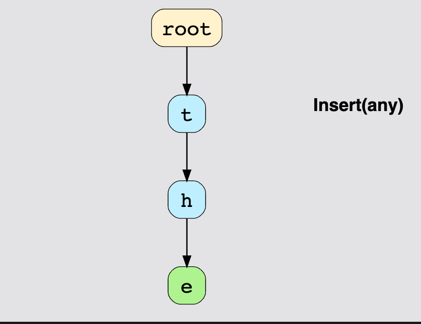
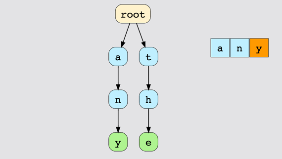
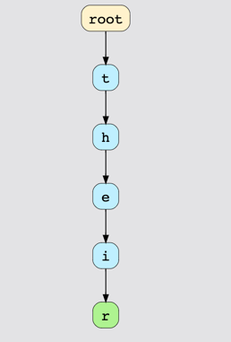
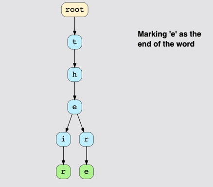

# Introduction to Trie

In the previous section, we covered several common types of trees like Red-Black trees, 2-3 trees, etc.

Now, we are going to look at a tree-like data structure that proves to be really efficient when solving programming problems related to **strings**.

This data structure is called a **Trie** and is also known as a **Prefix Tree**. We will soon find out why.

The term **Trie** is derived from the word "retrieval." As you can guess, the main purpose of using this structure is to provide **fast retrieval**. Tries are mostly used in **dictionary word searches**, **search engine auto-suggestions**, and **IP routing** as well.

## Common Applications of Tries
Let’s have a look at some real-life examples to understand the role of tries.

### 1. Autocomplete Words
Today, the autocomplete feature is supported by almost all major applications. This feature can be very efficiently implemented with the help of tries as they reduce the overall cost of performance.

### 2. Spell-Checking
Tries come in handy when you need to perform a **spell-check** on a word entered by the user. This feature is really helpful when the user does not know the exact spelling of a word they are searching for.

### 3. Searching for a Phone Contact
Another real-life use of Tries is searching for contacts in our contact list. It provides auto-suggestions based on the combination of letters that we enter. As you’ll see later on, this can also be performed with **hash tables**, but a hash table won’t be as efficient as a Trie.

## Properties of a Trie
To maintain its overall efficiency, Tries follow a certain structure:

- Tries are similar to graphs as they are a combination of **nodes** where each node represents a unique **letter**.
- Each node can point to **None** or other **children nodes**.
- The size of a Trie depends upon the number of **characters**. For example, in the English alphabet, there are 26 letters, so the number of unique nodes cannot exceed **26**.
- The **depth** of a Trie depends on the **longest word** that it stores.
- Another important property of a Trie is that it provides the **same path** for words that share a **common prefix**. For example, “there” and “their” have a common prefix “the.” Hence, they will share the same path until the character “e.” After that, the path will split into two branches. This is the backbone of the Trie functionality.

# Structure of Trie

In this lesson, we will take a look at the basic structure of a Trie and then build a class in Python based on what we’ve studied.

## Trie Example
A Trie containing the words "top", "thus", and "their" can be visualized as follows:

```
   (Root)
    |
    t
   / \
  o   h
  |   |
  p   u
     / \
    s   e
         |
         i
         |
         r
```
*Figure: Trie containing "top", "thus", and "their"*

## The Trie Node Class
The node of a Trie represents a letter. For example, if you want to insert “hello” into the Trie, you need to add 5 nodes, one for each letter. A typical node in a Trie consists of three data members:

1. **char**: This stores the character in the node.
2. **children**: An array that consists of pointers to children nodes. The size of this array depends on the size of the alphabet, which is 26 for English.
3. **is_end_word**: A flag to indicate the end of a word. It is set to `False` by default and is only updated when a word ends during insertion. When this flag is `True`, the node is treated as a leaf.

### Python Implementation of Trie Node Class
```python
class TrieNode:
    def __init__(self, char=''):
        self.children = [None] * 26  # This will store pointers to the children
        self.is_end_word = False  # True if the node represents the end of word
        self.char = char  # To store the value of a particular key

# Example usage:
trie_node = TrieNode('a')
print(trie_node.char)  # Output: a
```
In the above code, `TrieNode` is used to represent a single character of a word. The `children` attribute keeps track of the possible children nodes, and `is_end_word` helps identify if this node marks the end of a valid word.

## The Trie Class
The Trie itself is implemented using the `TrieNode` class. As discussed earlier, a Trie node represents one letter, which keeps pointers to its children nodes. Each node can have a maximum of **26 children** if we are storing English words.

- A **root node** is placed at the top and contains **26 pointers** (one per letter). These pointers hold either `None` or another `TrieNode`. The root is similar to the `head_node` from linked lists.
- All the words are stored in a **top-bottom manner**. While storing the last character, we should always set the `is_end_word` flag as `True` to indicate the end of a word. This technique helps us in searching for a word to see if it exists.

### Python Implementation of Trie Class
```python
class Trie:
    def __init__(self):
        self.root = TrieNode()  # Root node

    # Function to insert a key in the Trie
    def insert(self, key):
        pass

    # Function to search a given key in Trie
    def search(self, key):
        return False

    # Function to delete given key from Trie
    def delete(self, key):
        pass
```
In this code:
- The `insert()` function adds new words to the Trie. Each character of the word is added as a node, and the flag `is_end_word` is set to `True` at the last character.
- The `search()` function looks for a word in the Trie and returns `True` if the word exists, otherwise returns `False`.
- The `delete()` function is a placeholder that would handle removing words, keeping the structure and balance of the Trie intact.

## Summary
The **Trie** is a highly efficient data structure for storing and retrieving strings. Each **TrieNode** represents a character and can have up to 26 children (for English alphabet letters). The **Trie Class** manages these nodes, allowing for operations like **insertion**, **searching**, and eventually **deletion**. This unique structure makes Tries particularly useful in applications involving **autocomplete**, **spell-checking**, and **search suggestions**.

# Trie Word Insertion

The insertion process for a **Trie** is fairly simple. For each character in the key, we check if it exists at the desired position. If the character is not present, we insert the corresponding Trie node at the correct index in the children array. When inserting the last character, we also set the value of `is_end_word` to `True`.

There are three primary cases to consider during insertion. Let’s discuss them.

## Case 1: No Common Prefix
In this situation, we want to insert a word whose characters do not share any common prefix with existing words in the Trie.

**Example**: Suppose the Trie currently contains only the word "the", and we want to insert the word "any". Since there is no common subsequence between "the" and "any", we need to create nodes for all the characters of the word "any".




## Case 2: Common Prefix
This occurs when the starting characters of the word we want to insert are already in the Trie, starting from the root node.

**Example**: Suppose we want to insert the word "there" into a Trie that already contains the word "their". The characters "the" already exist in the Trie. We only need to add new nodes for "r" and "e" as shown below:




## Case 3: Word Exists
This occurs if the word we want to insert is a **substring** of another word that already exists in the Trie.

**Example**: Suppose we want to insert the word "the" into a Trie that already contains "their". Since the path for "the" already exists, we only need to set the value of `is_end_word` to `True` at the last character "e" to represent the end of the word "the".


# Trie Search Algorithm

If we want to check whether a word is present in the Trie or not, we simply trace the path in the Trie corresponding to the characters in the word. The logic isn’t too complex, but there are a few cases we need to consider.

## Case 1: Non-Existent Word
If we are searching for a word that doesn’t exist in the Trie and is not a subset of any other word, we will encounter a missing node before the last character of the word can be found.

**Example**: Suppose we are searching for the word "bedroom" in a Trie that only contains the word "bed".

### Graph Illustration
```
(Root) - b - e - d
```
- **Search for "bedroom"**:
  - Start at the root, then go to nodes **b**, **e**, and **d**.
  - When attempting to find **r**, there is no corresponding node, indicating that "bedroom" does not exist in the Trie.

## Case 2: Word Exists as a Substring
This occurs when the word we are searching for can be found as a **substring** of another word, but the `is_end_word` property for the node is set to `False`.

**Example**: Suppose we are searching for the word "be" in a Trie that already contains the word "bed".

### Graph Illustration
```
(Root) - b - e - d
```
- **Search for "be"**:
  - Start at the root, then go to nodes **b** and **e**.
  - The node **e** is reached, but `is_end_word` is `False`, indicating that "be" is not a complete word in the Trie.

## Case 3: Word Exists
The successful case occurs when there exists a path from the root to the node of the last character in the word, and that node is also marked as `is_end_word`.

**Example**: Suppose we are searching for the word "bed" in the Trie.

### Graph Illustration
```
(Root) - b - e - d
```
- **Search for "bed"**:
  - Start at the root, then go to nodes **b**, **e**, and **d**.
  - The node **d** is reached and `is_end_word` is `True`, indicating that "bed" is a complete word in the Trie.
- There exists a path from the root to the node representing "d", and the node is also marked with `is_end_word = True`. Therefore, the word "bed" is successfully found in the Trie.


## Summary
The **search** process in a Trie involves tracing the path defined by the word's characters. There are three possible scenarios during the search: the word does not exist, the word exists as a substring without the `is_end_word` flag, or the word exists and is marked as a valid word. Understanding these scenarios is crucial to effectively implementing and using Tries in practical applications.

# Deleting a Word in a Trie

When deleting a node in a Trie, it is important to ensure that the node we want to delete does not have any child branches. If there are no branches, we can easily remove the node. However, if the node contains child branches, different scenarios arise, which we will cover below.

## Case 1: Word with No Suffix or Prefix

If the word to be deleted has no suffix or prefix, and all character nodes of this word do not have any other children, we will delete all these nodes up to the root.

However, if any of these nodes have other children (i.e., they are part of another branch), they will not be deleted. This situation is further explained in **Case 2**.

For example, in the figure below, deleting the word **bat** would mean we have to delete all characters of **bat**:

```
    root
      |
      t
      |
      b
      |
      a
      |
      t
```

## Case 2: Word is a Prefix

If the word to be deleted is a prefix of some other word, then the value of `is_end_word` of the last node of that word is set to `False`, and no node is deleted.

For example, to delete the word **the**, we will simply unmark `e` to indicate that the word no longer exists:

```
    root
      |
      t
      |
      h
      |
      e (unmarked)
      |
      t
      |
      i
      |
      r
```

## Case 3: Word Has a Common Prefix

If the word to be deleted has a common prefix and the last node of that word has no children, then this node is deleted along with all the parent nodes in the branch that do not have other children and are not end characters.

For instance, to delete the word **their**, we will traverse the common path up to **the** and delete the characters `i` and `r`:

```
    root
      |
      t
      |
      h
      |
      e
      |
      t
```

In all of these cases, nodes are removed carefully, ensuring that the structure of the Trie and other words stored in it are not affected by the deletion.


